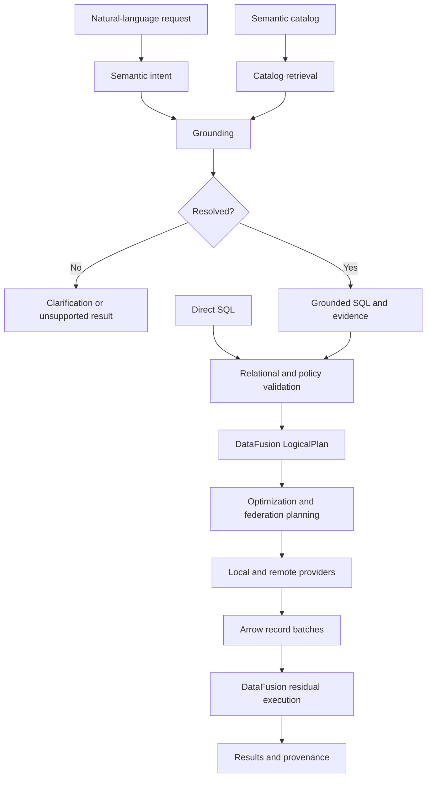
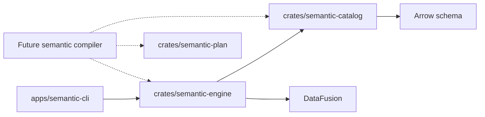

# System architecture

## Purpose and guiding decision

Semantic DB is a semantic, federated relational query engine. It should discover
how an organization's data can express user intent, then execute that
interpretation with precise relational semantics.

Keep probabilistic interpretation outside deterministic planning and execution.
The LLM proposes meaning; the catalog supplies definitions and evidence;
DataFusion resolves and executes relational plans. An optimizer must never need
to consult an LLM to decide whether two expressions are equivalent.

## Target query flow

Validation spans two stages: domain checks before lowering, and DataFusion name,
type, and function resolution while building a logical plan. Direct SQL skips
interpretation and grounding, but still goes through the deterministic planner.

## Workspace boundaries

| Component | Owns | Does not own |
| --- | --- | --- |
| Catalog | Descriptive relation metadata, Arrow schemas, view definitions, vocabulary | Execution or LLM inference |
| Semantic plan | Serializable unresolved intent, grounding evidence, ambiguity outcomes | DataFusion internals or backend credentials |
| Engine | Session state, provider registration, SQL planning, result execution | Terminal interaction or prompt templates |
| CLI | Arguments, line editing, display, user-facing errors | Relational optimization |

The initial engine intentionally exposes DataFusion `DataFrame` for advanced
consumers. This avoids inventing a second query API while the design is young;
it also means DataFusion upgrades can affect the engine's public API. Arrow
schemas define row types and Arrow batches define result interchange.

Create new crates when they have working responsibilities: a compiler, a retrieval
service, and individual connector implementations are likely next candidates.
Empty federation and LLM crates would imply interfaces we have not validated yet.

## Runnable slice

An `Engine` owns a private `SessionContext` and a descriptive `Catalog`. CSV
registration builds a lazy DataFusion provider and records its inferred schema.
View registration plans its defining SQL, records direct dependencies, and
registers the plan as a view without collecting its rows. Queries return batches;
`plan_sql` also permits DataFusion's streaming API.

Registration takes `&mut self`. Duplicate names and invalid definitions fail
without replacing existing relations. Only explicit registration APIs change the
catalog; query SQL disallows DDL, DML, and session-mutating statements. These are
catalog consistency controls, not a complete sandbox for untrusted workloads.

Metadata and providers are process-local. CSV data remains at its source and can
change between queries; no snapshot isolation is promised. Source schemas are
inferred at registration, and source schema changes require a new session today.

## Scope of DataFusion

DataFusion supplies SQL parsing and planning, optimization, local execution, and
extension interfaces. It does not by itself supply organizational definitions,
an LLM compiler, remote API connectors, or the intended federation policy. Use
its native extension points when these components become necessary.

The dependency enables SQL and recursive plan protection explicitly. Optional
Parquet, compression, and extra expression families can be enabled when required.
Rust 1.94.0 and DataFusion 55 are pinned at the workspace/toolchain boundary;
`Cargo.lock` records the complete resolved graph.

## References

- [DataFusion 55 library and crate features](https://docs.rs/datafusion/55.0.0/datafusion/)
- [SQL API and SessionContext](https://datafusion.apache.org/library-user-guide/using-the-sql-api.html)
- [DataFusion extension points](https://datafusion.apache.org/library-user-guide/index.html)
