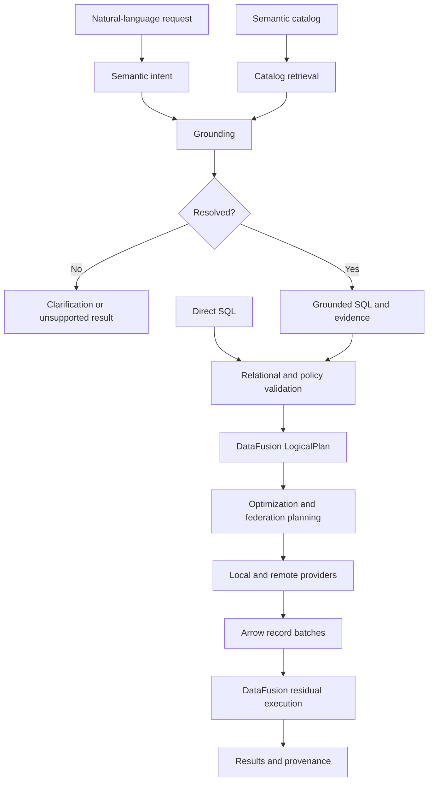
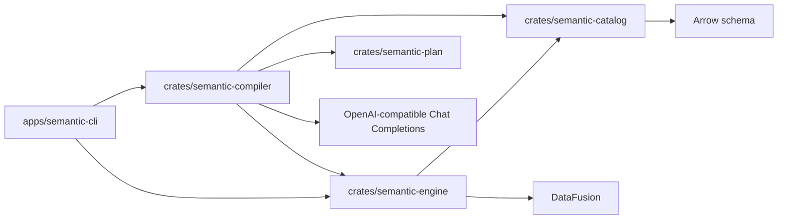

# System architecture

## Purpose and guiding decision

Semantic DB is a semantic, federated relational query engine. It should discover
how an organization's data can express user intent, then execute that
interpretation with precise relational semantics.

Keep probabilistic interpretation outside deterministic planning and execution.
The LLM proposes meaning; the catalog supplies definitions and evidence;
DataFusion resolves and executes relational plans. An optimizer must never need
to consult an LLM to decide whether two expressions are equivalent.

## Target query flow

Validation spans two stages: domain checks before lowering, and DataFusion name,
type, and function resolution while building a logical plan. Direct SQL skips
interpretation and grounding, but still goes through the deterministic planner.

## Workspace boundaries

| Component | Owns | Does not own |
| --- | --- | --- |
| Facade (`semantic-db`) | One dependency for embedding and consistent public re-exports | Separate planning or execution logic |
| Catalog | Descriptive relation metadata, Arrow schemas, view definitions, vocabulary | Execution or LLM inference |
| Semantic plan | Serializable unresolved intent, grounding evidence, ambiguity outcomes | DataFusion internals or backend credentials |
| Engine | Catalog loading, backend resolution, provider registration, SQL planning, execution | Terminal interaction or prompt templates |
| Compiler | Catalog projection, provider calls, grounding outcomes, validation, bounded repair | Query execution or deterministic domain definitions |
| Ossie adapter | Offline schema validation, explicit provider bindings, declared-field projections, semantic annotation import | Implicit connections, relationship/metric execution, or key enforcement |
| CLI | Arguments, line editing, display, user-facing errors | Relational optimization |

The initial engine intentionally exposes DataFusion `DataFrame` for advanced
consumers. This avoids inventing a second query API while the design is young;
it also means DataFusion upgrades can affect the engine's public API. Arrow
schemas define row types and Arrow batches define result interchange.

Create new crates when they have working responsibilities. The compiler now owns
the first natural-language slice; retrieval and individual remote connectors are
future candidates.

## Current compiler slice

`Compiler<P: ModelProvider>` combines interpretation and SQL proposal in one
model call. It sends a projection of the full in-memory catalog, then parses a
strict `GroundingOutcome`. Grounded output requires nonempty evidence with valid
catalog references and successful `Engine::plan_generated_sql`. Invalid JSON,
outcome shape, evidence, or SQL can receive one repair by default (configurable
in the library, capped at three). Clarification and unsupported outcomes return
immediately. Compilation plans but never collects rows; the CLI executes only a
grounded result, unless dry-run was requested.

The OpenAI-compatible adapter calls `/chat/completions` with JSON mode by default.
The model, API root, timeout, and JSON mode are configurable. Responses are checked
for refusal, normal completion, size, and envelope shape. HTTP/transport failures
are not retried, redirects are disabled, and provider bodies/credentials are not
included in errors. See the [official JSON mode guidance](https://developers.openai.com/api/docs/guides/structured-outputs#json-mode)
for why JSON validity still requires local schema validation.

This is a combined proposal flow, not the full target pipeline. `SemanticPlan`
is not yet lowered deterministically. Evidence existence and SQL validity cannot
prove meaning, coverage, units, or grain; those need curated catalog constraints
and future semantic validation. The whole catalog is sent without retrieval or
access filtering. Embedding applications must supply a catalog already scoped to
the caller's permissions.

## Runnable slice

An `Engine` owns a private `SessionContext` and a descriptive `Catalog`. CSV
registration builds a lazy DataFusion provider and records its inferred schema.
`Engine::from_catalog` accepts a team's authored definitions and resolves base
relations through `RelationBackend`, which returns standard DataFusion providers.
It validates declared schemas and plans views in dependency order. Missing
dependencies and cycles fail before backend resolution. The library facade and
backend example are described in the [embedding guide](../embedding.md).
View registration plans its defining SQL, records direct dependencies, and
registers the plan as a view without collecting its rows. Queries return batches;
`plan_sql` also permits DataFusion's streaming API.

Registration takes `&mut self`. Duplicate names and invalid definitions fail
without replacing existing relations. Only explicit registration APIs change the
catalog; query SQL disallows DDL, DML, and session-mutating statements. These are
catalog consistency controls, not a complete sandbox for untrusted workloads.

Metadata and providers are process-local. CSV data remains at its source and can
change between queries; no snapshot isolation is promised. Source schemas are
inferred or validated at registration, and schema changes require a new session
today. External catalog formats are evaluated in the
[prior-art comparison](../catalog-prior-art.md).

## Scope of DataFusion

DataFusion supplies SQL parsing and planning, optimization, local execution, and
extension interfaces. It does not by itself supply organizational definitions,
an LLM compiler, remote API connectors, or the intended federation policy. Use
its native extension points when these components become necessary.

The dependency enables SQL and recursive plan protection explicitly. Optional
Parquet, compression, and extra expression families can be enabled when required.
Rust 1.94.0 and DataFusion 55 are pinned at the workspace/toolchain boundary;
`Cargo.lock` records the complete resolved graph.

## References

- [DataFusion 55 library and crate features](https://docs.rs/datafusion/55.0.0/datafusion/)
- [SQL API and SessionContext](https://datafusion.apache.org/library-user-guide/using-the-sql-api.html)
- [DataFusion extension points](https://datafusion.apache.org/library-user-guide/index.html)
