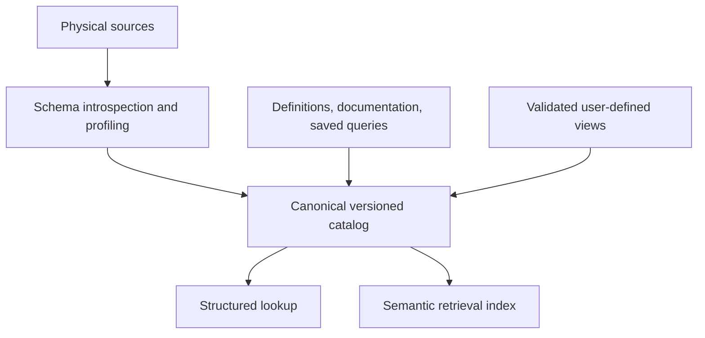

# Catalog and derived relations

## One relational model

A base dataset and a user-defined query both expose a relation with an Arrow
schema. A conceptual `DeepWell` is the row type; `deep_wells` is the relation
containing those rows. Nested custom SQL types are unnecessary until an actual
use case requires them.

```sql
-- Target SQL authoring form; the initial CLI uses .view or --view instead.
CREATE VIEW deep_wells AS
SELECT well_id, well_name, basin, total_depth_m
FROM wells
WHERE total_depth_m >= 2500;

SELECT well_id
FROM deep_wells
WHERE basin = 'North Basin';
```

The depth cutoff is an illustrative, explicitly chosen definition. It is not a
universal meaning of “deep.” Store the unit, reference datum, and organizational
definition alongside a real concept.

## Current metadata

`Relation` contains a name, Arrow schema, base/view kind, optional description,
owner, and grain. Base relations record a source string. Views record defining
SQL and direct dependency names. `Relation::base` and `Relation::view` plus
`with_description`, `with_owner`, and `with_grain` support authored metadata.
`Engine::from_catalog` loads these definitions through a team's `RelationBackend`.
CSV registration and interactive view creation still infer schemas and leave
optional metadata empty. See the [embedding guide](../embedding.md).

`Concept` sketches a curated name, description, definition, and evidence
reference. Concepts are not yet stored or searched by the in-memory catalog.
`Catalog` currently registers and looks up relations only.

The descriptive catalog complements DataFusion's execution catalog. DataFusion
knows how to scan a provider; the semantic catalog should know what its rows mean.
Today the engine coordinates the two during registration and checks declared
schemas against providers and planned views. A durable version will
need a transactional registration protocol rather than independent writes.

## Planned catalog model

| Object or metadata | Purpose |
| --- | --- |
| Qualified relation ID and revision | Stable identity across rename, namespaces, and schema changes |
| Columns | Types, nullability, descriptions, units, coordinate/reference systems, allowed values |
| Relationships | Join keys, cardinality, grain, and validated constraints |
| View definition | Canonical SQL or versioned project IR, output schema, bound dependency revisions |
| Functions | Scalar or table-valued signatures, determinism, execution capability |
| Concepts | Curated predicates or meanings, aliases, evidence, and ambiguity rules |
| Knowledge artifacts | Saved queries, documentation, example usage, provenance, access scope |
| Materialization policy | Storage location, refresh schedule, freshness, invalidation, and cost |

Physical origin and materialization are separate concerns. A CSV, SQL backend,
or API can provide a base relation. A view can later have a cached realization
without changing its logical identity. A parameterized relation should use a
table-valued function with a declared signature, not a special object endpoint.
Table functions and materializations are design targets, not implemented features.

## Lineage and persistence

Store query definitions rather than forcing eager materialization. In-memory
views retain DataFusion plans so outer predicates and projections can be
optimized with the defining query. Actual pushdown depends on the provider and
expression; it is not guaranteed for every filter.

The initial engine resolves direct references from the defining SQL before view
expansion, including subqueries and excluding local CTE names. A view over
another view records that view as its immediate
dependency. Recursive lineage can later expand through catalog definitions.
Names cannot be replaced today, preventing a common source of stale lineage.
Catalog loading computes dependency order, rejects missing references and cycles,
and recomputes imported lineage from SQL before exposing a usable engine.

For durable storage, prefer versioned canonical SQL or a project-owned IR plus
catalog/dependency versions. DataFusion `LogicalPlan` is an in-process compilation
artifact, not an assumed stable disk format. Replan and validate after reload or
engine upgrades. Definition changes should check dependent revisions and cache
invalidation before publication; initial loading already validates cycles and
output schemas.

## Two catalog ingestion paths



The retrieval index is a rebuildable projection of canonical metadata. Retrieval
must preserve object IDs, revisions, evidence, and access scope. A similar name
or historical query is a candidate interpretation, not automatic proof that a
definition is applicable.

In a geospatial dataset, column metadata should distinguish latitude/longitude
degrees from projected distances, and measured depth from true vertical depth.
These annotations support grounding and validation; the engine itself remains
independent of any particular domain.
