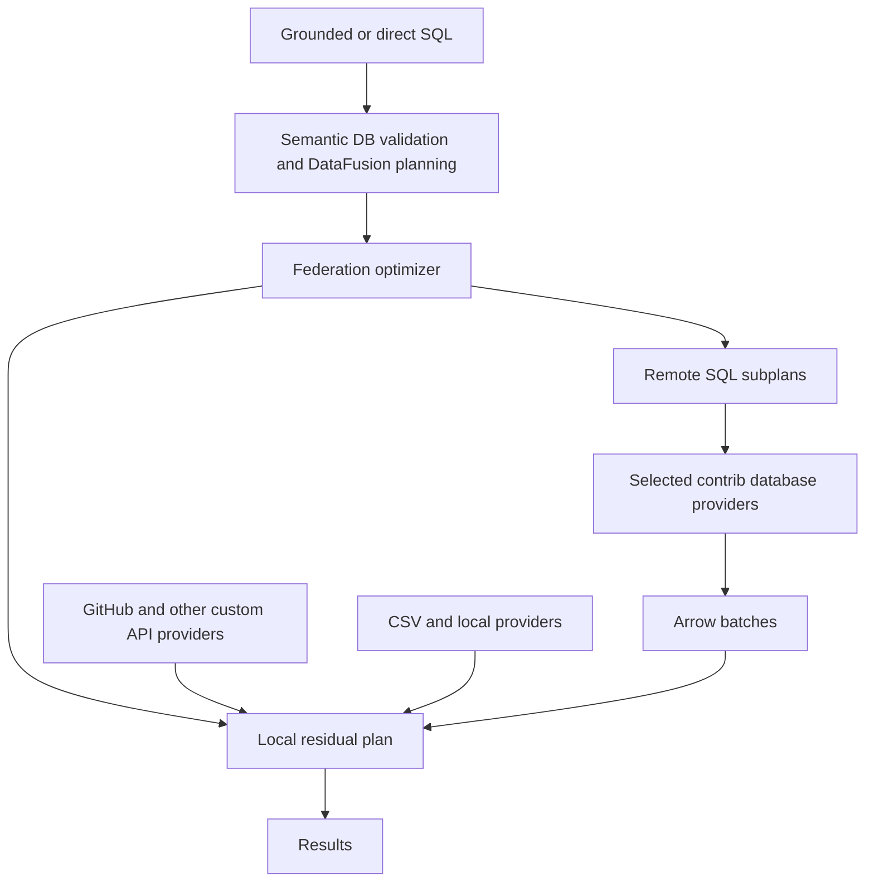

# Evaluating DataFusion contrib for Semantic DB federation

Analysis date: 12 September 2026. This is a source and architecture review, not a benchmark or a completed integration. No application code or dependencies were changed, and no upstream test suites or live database queries were executed.

**Recommendation: reuse core federation; decide connector ownership per backend.** Use `datafusion-federation` for identifying and executing remote SQL subplans. Evaluate `datafusion-table-providers` as an optional source of concrete connectors, rather than adopting both packages as a single architectural decision. For a first ClickHouse integration, a small owned connector over the existing Rust client and Arrow IPC is a credible preferred starting point. For broader database coverage, reuse individual contrib providers where their behavior meets our requirements. Keep Semantic DB's semantic catalog, grounding, source configuration, API connectors, and execution policy. Avoid starting a general federation optimizer or SQL connector framework of our own.

This is a good architectural fit, but it is not currently a drop-in dependency combination. The immediate obstacle is DataFusion version alignment. The more consequential issues are conservative pushdown, connection identity, and the difference between efficient same-database queries and efficient cross-source joins.

The recommendation assumes remote SQL databases are a near-term requirement. If the next work is exclusively GitHub/GraphQL plus CSV, these libraries offer little immediate benefit; keep the existing provider path and defer SQL federation integration until there is a SQL workload to validate.

**What the two libraries contribute**

| Component | Contribution | Work that remains with us |
| --- | --- | --- |
| DataFusion itself, already adopted | Relational planning, local joins/aggregations, Arrow execution, provider interfaces | Source implementations and remote execution decisions |
| `datafusion-federation` | Finds subplans whose tables share a remote execution context; replaces them with federated nodes and plans their execution | Backend capability policy, identity boundaries, runtime controls |
| `datafusion-table-providers` | Database access, schema discovery, type conversion, SQL scans, and federation integration for selected connectors | Our configuration/secret adapters, selected-backend qualification, upgrade coordination |
| Semantic DB | Catalog meaning, Ossie field mappings, grounded SQL, connector registration, API row contracts | These remain product responsibilities |

The libraries are complementary. Federation supplies planning infrastructure; table-providers supplies concrete source access. Registering a compatible provider alone does not enable whole-subplan federation: the session also needs the federation optimizer and query planner. The framework remains explicitly alpha. [Federation overview](https://github.com/datafusion-contrib/datafusion-federation/blob/c654ea75a15261f69fcdddedc6185d77a949743d/README.md), [provider overview](https://github.com/datafusion-contrib/datafusion-table-providers/blob/e5fdc19ae2c8b0d806a82c4eedbd4538dbbc59fc/README.md).

Consider orders and customers in one PostgreSQL execution context, joined to a local team mapping. Federation can send a subtree joining orders to customers to PostgreSQL, then return Arrow batches for DataFusion to join with the mapping. An aggregate entirely inside that remote subtree can also execute remotely. An aggregate above the local join remains local unless a separate, valid rewrite moves it. This placement follows the available plan tree; it is not a promise that the cheapest global plan will be found. [Optimizer implementation](https://github.com/datafusion-contrib/datafusion-federation/blob/c654ea75a15261f69fcdddedc6185d77a949743d/datafusion-federation/src/optimizer/mod.rs).

**The current version mismatch is real**

The following versions were checked against the local manifests/lockfile, downloaded upstream source, and the crates.io API. Cached documentation pages lagged the registry for table-providers, so the registry was checked directly.

| Component | Reviewed version/revision | DataFusion | Arrow |
| --- | --- | --- | --- |
| Semantic DB | `b430780a71548d18472db12aebdb837489bd225a` | Manifest and lock: 55.0.0 | Schema requirement 59.2.0; lock resolves 59.3.0 |
| Federation | Published 0.5.6; HEAD `c654ea75a15261f69fcdddedc6185d77a949743d` | 55 | `arrow-json` requirement 59.2 |
| Table-providers | Published 0.13.1; reviewed HEAD `e5fdc19ae2c8b0d806a82c4eedbd4538dbbc59fc` | 54.0 | Requirements 58.0; upstream lock resolves 58.3.0 |

Federation 0.5.6 was published on 2 September; providers 0.13.1 on 28 August. The reviewed providers HEAD includes changes after that publication, including Oracle. Treat those additions as HEAD capabilities unless separately verified in a published package. [Federation release metadata](https://crates.io/api/v1/crates/datafusion-federation), [providers release metadata](https://crates.io/api/v1/crates/datafusion-table-providers), [federation manifest](https://github.com/datafusion-contrib/datafusion-federation/blob/c654ea75a15261f69fcdddedc6185d77a949743d/Cargo.toml), [providers manifest](https://github.com/datafusion-contrib/datafusion-table-providers/blob/e5fdc19ae2c8b0d806a82c4eedbd4538dbbc59fc/Cargo.toml).

A provider implementing DataFusion 54's `TableProvider` cannot be passed directly as DataFusion 55's trait object. Compiling both versions does not solve this; their Arrow types also differ. Disabling the providers' federation feature does not resolve the provider API mismatch.

There is also a dependency-resolution trap: providers declares federation `0.5.5`, which is a caret requirement permitting 0.5.6. Its checked-in lockfile retains 0.5.5, but a downstream application resolves its own dependency graph. Federation changed its DataFusion major dependency in a patch release. A 54-based experiment should explicitly retain federation `=0.5.5`; a 55-based integration needs the selected providers and shared crates ported together. Verify with `cargo tree -d`, `cargo tree -e features`, and compilation. [Providers lockfile](https://github.com/datafusion-contrib/datafusion-table-providers/blob/e5fdc19ae2c8b0d806a82c4eedbd4538dbbc59fc/Cargo.lock), [federation changelog](https://github.com/datafusion-contrib/datafusion-federation/blob/c654ea75a15261f69fcdddedc6185d77a949743d/datafusion-federation/CHANGELOG.md).

For an adopted provider, use a narrow DataFusion 55 port of the chosen provider and common crate, suitable for an upstream contribution. Keep any temporary patch pinned to a commit and remove it after a compatible release. A coherent 54-based isolated experiment is a fallback; downgrading the entire product merely to start evaluating connectors is less attractive. An owned ClickHouse connector using federation 0.5.6 avoids the table-providers version mismatch altogether. None of these integration routes has been compiled in this review.

**Fit with our existing architecture is strong**

Our integration seams already return `Arc<dyn TableProvider>`. `ConnectorFactory` validates options and creates a reusable `SourceConnection`; `SourceConnection::table` constructs a provider. `Project::load` reuses connections and binds only sources required by the selected model. A contrib adapter can fit here without changing authored Ossie models or introducing another catalog abstraction. [Source interfaces](/Users/dorran/dev/semantic-db/crates/semantic-sources/src/lib.rs:65), [project loading](/Users/dorran/dev/semantic-db/crates/semantic-sources/src/lib.rs:280).

The required engine change is session construction. `Engine::new` currently creates a regular context with information-schema support. Add an explicit federation-enabled construction path, installing both the optimizer rules and `FederatedQueryPlanner` while preserving the existing configuration. Upstream's helper inserts federation after `scalar_subquery_to_join`; its ordering and planner setup should be the starting point. Preserve the existing generated-SQL restrictions and registration behavior. [Our constructor](/Users/dorran/dev/semantic-db/crates/semantic-engine/src/lib.rs:87), [upstream session setup](https://github.com/datafusion-contrib/datafusion-federation/blob/c654ea75a15261f69fcdddedc6185d77a949743d/datafusion-federation/src/lib.rs).

Ossie projections require an integration test, but source inspection gives reason for optimism. The importer creates a projected, possibly renamed view over each physical provider. DataFusion 55's `ViewTable` exposes its logical plan, and its logical-plan builder inlines a table source's plan when constructing an unfiltered scan. This should expose the underlying federation adaptor to the optimizer through the ordinary query path. That is an inference, not an executed proof. Verify same-source joins through two imported datasets, renamed fields, repeated aliases, and derived views. Do not expose undeclared physical fields as a workaround. [Ossie projection](/Users/dorran/dev/semantic-db/crates/semantic-ossie/src/document.rs:458), [DataFusion view implementation](https://github.com/apache/datafusion/blob/55.0.0/datafusion/catalog/src/view.rs), [plan-builder inlining](https://github.com/apache/datafusion/blob/55.0.0/datafusion/expr/src/logical_plan/builder.rs).

Avoid wrapping a federated provider in an opaque generic delegating provider without checking visibility. The federation optimizer recognizes its specific adaptor by downcast. A wrapper that conceals that adaptor can silently prevent federation even if ordinary scans still work. A capability wrapper should preserve the federation source or implement its restrictions within the federation extension points. [Adaptor recognition](https://github.com/datafusion-contrib/datafusion-federation/blob/c654ea75a15261f69fcdddedc6185d77a949743d/datafusion-federation/src/optimizer/mod.rs).

**ClickHouse: the incremental value of table-providers is modest**

The original broad recommendation needs this backend-specific qualification. ClickHouse can emit Arrow IPC streams directly. Its contrib connector uses the existing `clickhouse::Client`, requests `ArrowStream`, and feeds bytes into Arrow's decoder. It does not need an extensive handwritten conversion layer for every result cell. Its five backend source files total 775 lines including comments and boilerplate, excluding shared infrastructure and tests; this is a scope indicator, not an effort estimate. [ClickHouse ArrowStream format](https://clickhouse.com/docs/reference/formats/Arrow/ArrowStream), [contrib connection implementation](https://github.com/datafusion-contrib/datafusion-table-providers/blob/e5fdc19ae2c8b0d806a82c4eedbd4538dbbc59fc/crates/clickhouse/src/conn.rs).

With core federation retained, an owned connector would provide:

- A configured Rust client and per-connection execution identity, integrated with our secret resolver.
- Schema acquisition, initially for explicit tables and ordinary views, using a schema-only Arrow response or a supplied schema.
- A `SQLExecutor` that submits generated SQL and lazily returns decoded Arrow batches.
- Registration through the core library's `SQLTableSource` and `FederatedTableProviderAdaptor`.
- A conservative scan provider as fallback, sharing the same execution transport. Core adaptors without a fallback cannot execute an ordinary scan when a plan is not federated.
- ClickHouse capability restrictions, fixed semantic settings, deadlines, cancellation, and conformance tests.

The core library continues to provide subplan grouping, logical and physical federation nodes, table-reference rewriting, the SQL-unparser integration, and result schema casting. Its supplied table/source types avoid implementing that infrastructure again. [Core table types](https://github.com/datafusion-contrib/datafusion-federation/blob/c654ea75a15261f69fcdddedc6185d77a949743d/datafusion-federation/src/sql/table.rs), [core adaptor](https://github.com/datafusion-contrib/datafusion-federation/blob/c654ea75a15261f69fcdddedc6185d77a949743d/datafusion-federation/src/table_provider.rs).

Table-providers therefore buys us ready-made metadata handling, scan SQL construction, client-option plumbing, parameterized-view support, shared execution helpers, and existing tests. Those are useful savings, but they do not constitute another federation optimizer. The inspected ClickHouse implementation uses DataFusion's `DefaultDialect` and supplies no executor AST analyzer, so adopting it does not automatically supply a comprehensive ClickHouse dialect compatibility layer. [ClickHouse table setup](https://github.com/datafusion-contrib/datafusion-table-providers/blob/e5fdc19ae2c8b0d806a82c4eedbd4538dbbc59fc/crates/clickhouse/src/lib.rs), [scan implementation](https://github.com/datafusion-contrib/datafusion-table-providers/blob/e5fdc19ae2c8b0d806a82c4eedbd4538dbbc59fc/crates/clickhouse/src/sql_table.rs).

The difficult part of an owned connector is qualification rather than basic transport. Test arbitrary HTTP chunk boundaries, empty streams, dictionary batches, incomplete IPC messages, late server errors, and cancellation. Establish outer-join semantics explicitly: ClickHouse's `join_use_nulls=0` uses type defaults for missing matches, which differs from SQL NULL results. Arrow transport cannot correct that semantic difference after the fact. These concerns also require review when adopting the contrib implementation. [ClickHouse join guidance](https://github.com/ClickHouse/clickhouse-docs/blob/main/docs/best-practices/minimize_optimize_joins.md).

For a read-only ClickHouse-first product, I would now evaluate **core federation plus an owned narrow connector first**, using contrib as reference and potentially reusing specific code under its license. This gives us direct control of the policies we already need, with DataFusion 55 alignment today. Reconsider provider adoption if requirements expand to broad connector coverage or advanced metadata/view features. Do not generalize ClickHouse's favorable Arrow-stream boundary to every database.

**Connector coverage needs to be evaluated per implementation**

| Source | Assessment for Semantic DB |
| --- | --- |
| PostgreSQL | Strong first candidate: dedicated provider, connection pooling, conversion code, and a factory path that creates a federation adaptor. |
| ClickHouse | Dedicated federation-capable provider; attractive if this is the first product requirement. Fix connection grouping before enabling it across independent credentials. |
| MySQL, SQLite, DuckDB, ODBC | Federation integration is present in their factory paths. Useful future reuse; qualify only the backends we actually ship. |
| MongoDB | Dedicated scan/filter/projection implementation. Do not infer remote joins or aggregation pipelines from the package's optional federation dependency. |
| Flight SQL | Useful transport/provider infrastructure, but the inspected default driver submits a configured SQL query during metadata acquisition. It is not automatically an arbitrary-subplan `SQLExecutor`. |
| ADBC / potential Snowflake route | Useful driver-based access, but the inspected factory returns `AdbcDBTable` without a federation adaptor, and its pool disallows join pushdown. Treat Snowflake integration and subplan federation as additional work. |
| Oracle | Present in reviewed HEAD after 0.13.1 publication; do not assume the published facade contains it. |
| GitHub / generic REST or GraphQL | Neither repository replaces our API row mapping, pagination, scope, or selective pushdown logic. |

Evidence: [Postgres factory](https://github.com/datafusion-contrib/datafusion-table-providers/blob/e5fdc19ae2c8b0d806a82c4eedbd4538dbbc59fc/crates/postgres/src/lib.rs), [ClickHouse integration](https://github.com/datafusion-contrib/datafusion-table-providers/blob/e5fdc19ae2c8b0d806a82c4eedbd4538dbbc59fc/crates/clickhouse/src/federation.rs), [MongoDB table](https://github.com/datafusion-contrib/datafusion-table-providers/blob/e5fdc19ae2c8b0d806a82c4eedbd4538dbbc59fc/crates/mongodb/src/table.rs), [Flight SQL driver](https://github.com/datafusion-contrib/datafusion-table-providers/blob/e5fdc19ae2c8b0d806a82c4eedbd4538dbbc59fc/crates/flightsql/src/sql.rs), [ADBC factory](https://github.com/datafusion-contrib/datafusion-table-providers/blob/e5fdc19ae2c8b0d806a82c4eedbd4538dbbc59fc/crates/adbc/src/lib.rs), [ADBC pool](https://github.com/datafusion-contrib/datafusion-table-providers/blob/e5fdc19ae2c8b0d806a82c4eedbd4538dbbc59fc/crates/adbc/src/pool.rs).

Prefer a leaf crate such as `datafusion-table-providers-postgres`, with intentional features. Read its manifest rather than assuming all providers share defaults: the reviewed Postgres/ClickHouse leaves default to federation, while Flight SQL and MongoDB default to no features. Federation itself currently enables DataFusion's default dependency features, so adding it may broaden our deliberately lean build even if we disable defaults on our own DataFusion dependency. Measure the resulting feature graph and native-library requirements before making a connector standard. [Postgres manifest](https://github.com/datafusion-contrib/datafusion-table-providers/blob/e5fdc19ae2c8b0d806a82c4eedbd4538dbbc59fc/crates/postgres/Cargo.toml), [Flight manifest](https://github.com/datafusion-contrib/datafusion-table-providers/blob/e5fdc19ae2c8b0d806a82c4eedbd4538dbbc59fc/crates/flightsql/Cargo.toml), [federation dependency configuration](https://github.com/datafusion-contrib/datafusion-federation/blob/c654ea75a15261f69fcdddedc6185d77a949743d/Cargo.toml).

**The main correctness gap is capability policy**

The framework allows a provider-specific optimizer to choose what to federate. However, its generic SQL optimizer initially wraps the selected subplan, with optional hooks to rewrite it. SQL is subsequently generated with DataFusion's dialect-aware unparser. There is no comprehensive built-in proof that every remote operator or function matches DataFusion semantics. [SQL optimizer and execution](https://github.com/datafusion-contrib/datafusion-federation/blob/c654ea75a15261f69fcdddedc6185d77a949743d/datafusion-federation/src/sql/mod.rs).

Even ordinary scans need qualification: the common SQL provider classifies a filter as exact when the unparser can translate it and it contains no subquery. SQL representability alone does not prove equivalent collation, casts, timezone behavior, or numeric semantics. A federation-disabled baseline still exercises these provider filter decisions; it is not an independent correctness oracle. [Common SQL filter policy](https://github.com/datafusion-contrib/datafusion-table-providers/blob/e5fdc19ae2c8b0d806a82c4eedbd4538dbbc59fc/crates/common/src/sql/sql_provider_datafusion/mod.rs).

For us, this matters particularly when introducing local semantic, spatial, or custom aggregate functions. Keep unsupported operations above a remote subtree, or reject them clearly during planning. A backend SQL failure after execution starts is too late to discover that a local-only function was federated. An open issue documents a related SQLite cast/function problem. [Unsupported-function discussion](https://github.com/datafusion-contrib/datafusion-federation/issues/129).

The adaptor's fallback delegates to an ordinary provider when it has one. This is useful for disabling federation. It is not a general retry mechanism that reconstructs a local plan after a remote query fails. Some adaptors have no scan fallback at all. [Adaptor implementation](https://github.com/datafusion-contrib/datafusion-federation/blob/c654ea75a15261f69fcdddedc6185d77a949743d/datafusion-federation/src/table_provider.rs).

**Connection identity is a correctness boundary**

Federation groups providers using their name and `compute_context`. The SQL provider uses a common provider name, making context identity especially important. Equal contexts must mean tables can safely execute together using one executor, including authorization and relevant session semantics. [Provider equality](https://github.com/datafusion-contrib/datafusion-federation/blob/c654ea75a15261f69fcdddedc6185d77a949743d/datafusion-federation/src/lib.rs), [SQL provider identity](https://github.com/datafusion-contrib/datafusion-federation/blob/c654ea75a15261f69fcdddedc6185d77a949743d/datafusion-federation/src/sql/mod.rs).

The inspected ClickHouse pool builds its context from URL and optional database, omitting user. Postgres includes hosts, first port, database, and user, but omits session options such as a different search path. These are source observations; I have not reproduced an incorrect query. The implication is that separately configured connections can be grouped more broadly than our configuration contract intends. [ClickHouse context construction](https://github.com/datafusion-contrib/datafusion-table-providers/blob/e5fdc19ae2c8b0d806a82c4eedbd4538dbbc59fc/crates/clickhouse/src/pool.rs), [Postgres context construction](https://github.com/datafusion-contrib/datafusion-table-providers/blob/e5fdc19ae2c8b0d806a82c4eedbd4538dbbc59fc/crates/postgres/src/pool.rs).

Initially, use an opaque, namespaced identity per resolved Semantic DB connection instance. Tables sharing that connection can federate together; independently configured connections cannot. Deliberately allowing equivalence across instances can come later. The identity should contain no credentials because compute context appears in explain/debug output. Making this robust may require a narrow upstream change or a custom executor/pool adapter, rather than just option translation.

**Cross-source optimization remains limited**

Do not budget on automatic join-key shipping, temporary-table uploads, adaptive remote lookups, or a global network-cost optimizer. The current federation rule discovers same-context subtrees. The SQL executor has a runtime-filter hook, but the common SQL and ClickHouse executors explicitly ignore the supplied physical filters. The default executor statistics are unknown. These hooks offer extension points, not evidence that selective cross-source transfer is implemented. [SQLExecutor contract](https://github.com/datafusion-contrib/datafusion-federation/blob/c654ea75a15261f69fcdddedc6185d77a949743d/datafusion-federation/src/sql/executor.rs), [common executor](https://github.com/datafusion-contrib/datafusion-table-providers/blob/e5fdc19ae2c8b0d806a82c4eedbd4538dbbc59fc/crates/common/src/sql/sql_provider_datafusion/federation.rs), [ClickHouse executor](https://github.com/datafusion-contrib/datafusion-table-providers/blob/e5fdc19ae2c8b0d806a82c4eedbd4538dbbc59fc/crates/clickhouse/src/federation.rs).

For example, joining ten GitHub issue IDs to a very large remote SQL table does not imply a ten-key remote lookup. Unless static SQL predicates sufficiently restrict that scan, significant data may still cross the network. Our GitHub label pagination/N+1 behavior also remains unchanged. Measure remote rows/bytes and requests, not just the presence of a federated plan node.

Likewise, generic Substrait execution is still an open feature request. Flight transport support should not be interpreted as a distributed scheduler or transparent remote DataFusion plan execution. [Substrait issue](https://github.com/datafusion-contrib/datafusion-federation/issues/10).

**Runtime responsibilities and maintenance tradeoffs**

Streaming interfaces provide a useful foundation, but we still need a query-wide deadline and budget, connection-pool limits, backend cancellation verification, memory/spill policy, observability, and clear failure semantics. Dropping a local stream is not proof that every driver cancels server-side work. A pooled connection does not establish a shared snapshot across scans, let alone across databases. Default to failing the whole query on a source failure; invalidate earlier streamed batches if execution later fails. These are proposed product requirements, not claims that every underlying driver lacks the relevant facilities.

Keep our existing secret resolver and offline option validation. Use read-only source access for the read query path, preserve statement restrictions, and sanitize driver errors and captured SQL. Our generated-query planning should also validate executable federation boundaries: successful relational planning alone may not detect errors in SQL produced later during execution. Source schemas, remote function availability, and type conversion need an explicit compatibility contract.

There is evidence of ongoing maintenance: federation has recent DataFusion upgrades and fixes for explain behavior, result conversion, metrics, and physical-filter hooks. Its integration suite includes six recorded-SQL tests covering scans, filters, limits, aggregation, a negative control, and cross-provider joins. Those tests use DataFusion contexts as the remotes, so they do not establish equivalence against every database dialect. [Changelog](https://github.com/datafusion-contrib/datafusion-federation/blob/c654ea75a15261f69fcdddedc6185d77a949743d/datafusion-federation/CHANGELOG.md), [federation tests](https://github.com/datafusion-contrib/datafusion-federation/blob/c654ea75a15261f69fcdddedc6185d77a949743d/datafusion-federation/tests/federation_pushdown.rs).

Table-providers has per-crate checks and database integration CI. This is valuable shared maintenance, although this review inspected the workflow rather than verifying current run results. Both repositories declare Apache-2.0 licensing; table-providers explicitly states it is not an official ASF project. Avoid treating the contrib name as a support guarantee. [Provider CI](https://github.com/datafusion-contrib/datafusion-table-providers/blob/e5fdc19ae2c8b0d806a82c4eedbd4538dbbc59fc/.github/workflows/pr.yaml), [federation license](https://github.com/datafusion-contrib/datafusion-federation/blob/c654ea75a15261f69fcdddedc6185d77a949743d/LICENSE), [provider license](https://github.com/datafusion-contrib/datafusion-table-providers/blob/e5fdc19ae2c8b0d806a82c4eedbd4538dbbc59fc/LICENSE).

Open reports include recursive CTE failure, a join with a DISTINCT subquery, and unsupported functions. They identify useful regression cases; their existence is not proof every variant still fails. The inspected optimizer also explicitly rejects remaining `InSubquery` expressions and treats outer references conservatively. Test actual query shapes after DataFusion rewrites them. [Recursive CTE report](https://github.com/datafusion-contrib/datafusion-federation/issues/180), [DISTINCT join report](https://github.com/datafusion-contrib/datafusion-federation/issues/82), [optimizer source](https://github.com/datafusion-contrib/datafusion-federation/blob/c654ea75a15261f69fcdddedc6185d77a949743d/datafusion-federation/src/optimizer/mod.rs).

| Approach | Initial effort | Continuing ownership | Assessment |
| --- | --- | --- | --- |
| Build connectors and federation ourselves | Highest | Drivers, conversions, SQL generation, planning, policies, tests, upgrades | Hard to justify for ordinary SQL sources |
| Adopt providers, keep scan-level execution | Lower after version alignment | Adapters, scan correctness, runtime policy | Useful baseline; forfeits general join/aggregate subplan pushdown |
| Adopt both with selected-backend qualification | Moderate, with concrete integration risks | Adapters, capability restrictions, runtime policy, dependency matrix | Attractive for multiple supported SQL backends |
| Use federation with our own SQL executors | Backend-dependent; relatively contained for Arrow-native ClickHouse | Transport integration, scan fallback, backend semantics, runtime policy | Preferred first experiment for ClickHouse; assess other backends separately |
| Broad permanent fork of both | High and recurring | Upstream merges plus most specialist maintenance | Reserve for demonstrated product needs |

The largest saving from reuse is sharing database conversion and execution machinery, and avoiding duplicate subplan extraction/planning code. The remaining maintenance is substantial but more focused. Adoption should reduce our ownership to product-specific constraints and small upstreamable fixes rather than a second query engine inside Semantic DB.

**A concrete adoption spike**

For a ClickHouse-first direction, evaluate an owned connector with core federation. For evaluating contrib provider reuse, PostgreSQL is a useful first candidate. A database with two related tables plus a local CSV is enough to test the main architectural benefits; add the existing GitHub fixture for a mixed API case. The following steps describe the provider-reuse route; the owned ClickHouse route replaces the provider port with a client/Arrow executor and basic scan fallback.

1. **Align dependencies.** Compile the selected provider/common crates on DataFusion 55 with federation 0.5.6, or prove an isolated coherent 54 baseline first. Record exact versions, feature graph, native dependencies, and any patch. Avoid a broad repository migration just to demonstrate one connector.
2. **Implement the smallest adapter.** Add a connector factory and reusable connection wrapper with explicit table/schema options and the existing secret resolver. Separate offline validation, metadata I/O, and lazy row execution. Preserve the underlying federation adaptor.
3. **Wire the engine and importer path.** Add federation-enabled session construction and a way to disable it for comparisons. Test through `Project::load` and Ossie, not only raw DataFusion registration. Verify view aliases, declared-field visibility, and generated-query restrictions.
4. **Constrain capabilities and identity.** Restrict shared execution to the same resolved connection. Exercise a local-only function and ensure it remains local or is rejected clearly. If doing this requires a broad optimizer rewrite, reconsider whether provider-only adoption is the better first step.
5. **Compare three execution paths.** Run federation-enabled, federation-disabled, and independently populated local-reference queries using our conformance helper. Capture exact remote SQL, requests, rows/bytes, elapsed time, and peak local memory where available. Keep result comparisons independent of batch boundaries.

The acceptance cases should include:

| Case | Evidence required |
| --- | --- |
| Filter and projected field aliases | Correct schema/results and physical remote column names |
| Same-connection join plus aggregate | Remote SQL includes the join/aggregate; result and duplicate multiplicity match reference |
| Sort plus limit | Correct ordering, NULL placement, and result count; reduced transfer on the fixture |
| Remote plus CSV/GitHub join | Correct local join and separate remote subplans; measured transfer volume |
| Unsupported/local-only expression | Local residual evaluation or clear pre-execution rejection |
| Residual filter plus limit | Matching rows on later batches are not lost |
| Independent connections with identical endpoint/database | No accidental fusion, including different users or session options |
| Decimal, timestamp, NULL, and text edge cases | Exact supported semantics, with unsupported mappings rejected |
| Cancellation, timeout, and late stream failure | Bounded work and failed-query propagation; observe backend cancellation separately |
| Repeated executions and schema changes | Fresh execution state and documented schema-refresh behavior |

Adopt if this proves real remote work reduction through our normal configuration path, preserves our semantic and access boundaries, and requires only contained patches. If scan reuse works but safe subplan pushdown remains expensive, ship the selected providers first. If API-driven cross-source joins dominate performance, prioritize targeted runtime-filter or lookup work based on measured workloads; neither library removes that problem.

The expected integration size should be estimated after dependency alignment and the first Ossie join test. The remaining uncertainty is concentrated in those integration seams and backend semantics, so a fixed production timeline before the spike would be speculative.
