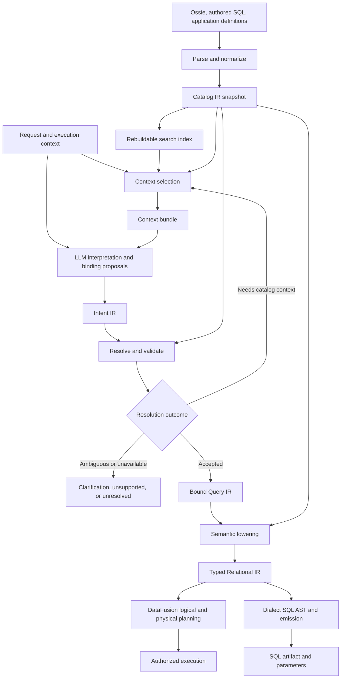

# Semantic compiler architecture

Status: proposed target architecture. This document describes intended contracts,
not implemented capabilities. Repository observations are current as of
2026-09-28. Examples and interface sketches are illustrative.

Read [the architecture](#2-architecture-and-boundaries) for the stage boundaries,
[normalization](#3-what-lossless-normalization-means) and
[context selection](#6-context-selection-and-completeness) for the catalog design,
and [binding](#8-binding-and-bound-query-ir) through
[SQL generation](#10-engine-planning-and-sql-generation) for the later query IRs.
[Tracing and performance](#15-guarantees-diagnostics-and-observability),
[worked examples](#12-worked-examples),
[evaluation](#16-evaluation-and-acceptance), and
[delivery stages](#17-delivery-path-from-the-current-repository) make the proposal
concrete. The sketches define responsibilities and invariants; final wire schemas
remain an implementation deliverable.

## 1. Decision and scope

Build a compiler around four explicit intermediate representations:

1. **Catalog IR:** a normalized, versioned representation of authored semantic
   knowledge and its physical bindings.
2. **Intent IR:** a structured interpretation of a request that can contain
   unresolved terms, alternatives, and missing information.
3. **Bound Query IR:** a typed semantic query whose references and definitions
   have been resolved against a catalog snapshot.
4. **Relational IR:** a deterministic expansion of the bound query into explicit
   relational operations, ready for engine planning or SQL emission.

Use a rebuildable search index to select catalog context. Keep authoritative
definitions in the Catalog IR. Construct a context bundle that supplies the
selected definitions, governing annotations, dependencies, and alternatives to
the model. A context bundle is a transport projection, not another source of
truth or an executable query IR.

The LLM proposes interpretations and bindings. Deterministic code validates them,
expands accepted semantic definitions, and generates relational plans and SQL.
Retrieval and interpretation remain fallible; typed output and successful SQL
planning do not prove that the user's meaning was understood correctly.

This architecture supports large semantic layers, multiple authoring formats,
authored SQL views, and eventual metrics and relationship support. It is not
limited to the current Ossie import profile. It preserves DataFusion as the
initial execution engine without making its internal plan serialization the
public semantic contract.

Natural-language writes, autonomous data profiling, a new physical query engine,
and arbitrary SQL equivalence proofs are outside this design. Explicit SQL and
write APIs retain their own validation and execution contracts.

### Goals

- Preserve supported authored meaning through normalization and compilation.
- Keep prompt size related to a request's needs rather than total catalog size.
- Make incomplete retrieval observable and recoverable.
- Separate business interpretation from relational implementation.
- Explain bindings, defaults, exclusions, assumptions, and failures using source
  references and compiler decisions.
- Support incremental catalog updates, reproducible compilation, and controlled
  evolution of the IRs.
- Measure correctness, coverage, latency, and total cost independently.
- Bound host-side catalog work as well as model context and calls.
- Explain compiler decisions through structured traces, correlate performance
  measurements with those decisions, and replay retained compilation artifacts.

### Core invariants

| Invariant | Consequence |
| --- | --- |
| Authored facts retain identity, scope, and provenance. | Deduplication cannot detach a rule from the objects it governs. |
| Unknown meaning remains unknown. | Omitted units, undeclared cardinality, and unsupported extensions cannot become convenient defaults. |
| Each compilation uses one catalog snapshot. | Retrieval, binding, validation, and lowering resolve the same object revisions. |
| Retrieval ranking is not semantic authority. | The highest-scoring interpretation does not automatically win over a competing definition. |
| Accepted bound queries contain no unresolved business choices. | Ambiguous concepts cannot cross the deterministic lowering boundary. |
| Every accepted request requirement has a disposition. | A required filter cannot disappear during lowering or repair. |
| Physical optimization preserves accepted meaning. | Cost does not choose between different definitions of revenue or different join roles. |
| Compilation does not execute result-producing queries. | Metadata inspection and any optional verification I/O have explicit, separate contracts. |
| Catalog identity differs from query occurrence identity. | Repeated uses of one relation retain distinct roles and scoped field references. |
| Instrumentation preserves compiler behavior. | Telemetry sampling, export failures, and debug capture cannot change accepted query meaning. |

## 2. Architecture and boundaries



The stages are logical boundaries, not a requirement for one model call per
stage. An interpreter may propose intent and candidate bindings in one call.
Deterministic retrieval can run before that call; interpretation can request
additional context when necessary. Structured clients may submit semantic queries
without using an LLM at all.

Catalog IR is the shared symbol and semantic database used throughout the
pipeline. Binding includes semantic analysis and planning before constructing an
accepted query; lowering realizes those settled decisions. Every stage receives
the same request context for snapshot identity, budgets, cancellation, and trace
correlation. Catalog publication and index construction have separate lifecycle
traces that compilation may reference.

| Artifact | Producer | Consumer | Acceptance condition | Lifetime |
| --- | --- | --- | --- | --- |
| Source archive and parsed document | Import adapter | Normalizer, diagnostics | Source syntax/schema status is recorded | Durable |
| Catalog IR | Normalizer and catalog publisher | Retrieval, binder, lowerer | Definitions are classified, references checked, executable scope explicit | Versioned snapshot |
| Search index | Index builder | Context selector | Index identifies the catalog revision and indexing configuration | Rebuildable |
| Context bundle | Selector and hydrator | Interpreter | Required known metadata is included or incompleteness is explicit | Request/cache artifact |
| Intent IR | Interpreter or structured client | Binder | Well-formed request decomposition; unresolved choices allowed | Explain/replay artifact |
| Bound Query IR | Binder and semantic validator | Lowerer | References, types, grain, applicability, and policy checks pass | Versioned query contract |
| Relational IR | Semantic lowering passes | Backend adapters | Business operators expanded; types and operator semantics explicit | Compiled artifact |
| Engine plan / SQL AST | Backend adapter | Runtime / SQL renderer | Target capabilities and backend validation pass | Backend-version-specific |
| Compilation record / decision provenance | Controller and stage implementations | Client, debugger, evaluation and observation adapters | Outcome, rule/artifact links, accounting, and capture completeness recorded | Request artifact; optional retained replay bundle |

Intent IR and Bound Query IR have different acceptance rules even if their initial
Rust implementation shares data types. Untrusted proposals must not deserialize
directly into a type whose name implies validation. A validated wrapper is
constructed only by the validator.

## 3. What lossless normalization means

### 3.1 Semantic fidelity and source fidelity

For supported constructs, normalization preserves authored values, their scope,
references, ordering where meaningful, distinctions between missing and explicit
values, and executable semantics. Two authored synonyms may share a string entry;
their ownership and provenance remain distinct.

Normalization is not required to reproduce original formatting from the IR.
Retain original document bytes and source locations separately when exact source
reproduction is required. YAML comments, anchors, and formatting are source
artifacts; supported values and their meaning belong in the normalized model.

In particular:

- Preserve exact decimal values, timestamp information, enum spelling, SQL
  dialect, and identifier case according to the authoring language's rules.
- Preserve authored prose verbatim. Normalization must not paraphrase a negative
  qualification into a positive definition.
- Keep example questions separate from definitions and explicit defaults.
- Keep absence, explicit null, false, and empty values distinct whenever the
  source contract distinguishes them. A compact renderer may elide a value only
  when the receiving contract reconstructs the same meaning.
- Preserve original expressions even when a checked expression AST is available.
  Do not claim that arbitrary SQL has been fully understood merely because it
  parses.
- Record adapter, source specification, normalization, and expression-semantics
  versions. Fidelity is defined relative to those contracts.

The canonical IR can be larger than its source due to indexes and resolved
references. Prompt savings come from deduplication and projection; a different
in-memory container does not itself reduce model input.

### 3.2 Unsupported and opaque input

Preserve unsupported input in the source archive, with diagnostics. An object has
an explicit capability state: executable, descriptive-only, or blocked by an
unsupported construct. Descriptive availability never implies executable support.

Unknown extensions may change filtering, joins, or metric meaning. They must not
be silently discarded. Block the affected executable scope. If the extension's
scope cannot be determined, block publication of that model as executable. A
partially supported model may be exposed only when the adapter can establish an
independent boundary; retrieval cannot hide an import error to make a query work.

An authored SQL view can be executable through a supported backend while some of
its business properties remain opaque. Preserve its exact definition and output
contract. Restrict semantic substitutions that would require unavailable proofs.

### 3.3 Safe compaction

| Transformation | Required condition |
| --- | --- |
| Intern repeated strings or definitions | Each original attachment, scope, and origin remains addressable. |
| Store model annotations once | Context hydration materializes them for selected descendants. |
| Combine field schema and semantic metadata | Physical type and semantic meaning remain separate typed properties. |
| Remove hashes and operational metadata from model input | The host retains provenance, and the context identifies its catalog snapshot. |
| Omit empty/default values | The context format has explicit reconstruction rules. |
| Use a compact prompt serialization | Token savings and interpretation quality are measured with the intended model. |
| Generate search summaries | Summaries are marked derived and never replace authoritative definitions at binding time. |

Avoid aggressive identifier abbreviation initially. Readable names help the model
interpret objects; stable IDs serve identity and validation. Both can be present.

## 4. Catalog IR

### 4.1 Identity, revisions, and source maps

Separate logical identity from content revision:

```text
ObjectId       = namespace + durable identity
ObjectRevision = digest of canonical definition and relevant semantic versions
ObjectRef      = ObjectId + ObjectRevision
CatalogSnapshot = immutable manifest of ObjectRefs and resolved bindings
SourceRef      = artifact revision + document path + optional source span
```

An explicit authored ID survives a rename. Where none exists, derive a qualified
identity from the source namespace and path; document that a rename creates a new
identity unless an explicit migration maps it. Never merge equally named objects
from different models based on a similarity score or matching content hash.

Use separate digests for source bytes, normalized semantic content, and complete
compilation inputs. A comment-only edit can change source provenance without
invalidating semantic indexes. A view edit, physical type change, policy change,
or function-semantics change can invalidate compilation despite unchanged Ossie.

Source maps connect a definition or fact to all its contributing source locations.
Conflicts retain both origins. Deterministic ordering is required for hashing and
serialization; unordered maps must not cause prompt or cache instability.

### 4.2 Object model

| Object | Required semantic information |
| --- | --- |
| Namespace / domain / model | Identity, scoped annotations, aliases, applicability, explicit defaults |
| Entity | Business identity, key candidates, identity scope, relevant temporal interpretation |
| Relation | Output fields, row meaning, grain, source binding or view definition, coverage |
| Field / dimension | Physical and logical types, nullability, units, value semantics, aliases, time role |
| Relationship | Endpoint entities, key expressions, role, direction, join semantics, cardinality evidence, temporal conditions |
| Measure / metric | Expression, source grain, aggregation behavior, dimensions, filters, time semantics, units, dependency graph |
| Concept | Authored definition or descriptive meaning, scope, parameters, aliases, alternatives |
| View | Source SQL and dialect, checked representation where available, output contract, dependencies, known restrictions |
| Function | Stable signature, null behavior, determinism/volatility, semantic version, target implementations |
| Constraint / policy | Predicate or rule, applicable scope, authority, enforcement point, revision |
| Knowledge artifact | Authored notes, examples, saved queries, source references, applicability and authority |

These are logical object families. They do not require independent storage tables
or Rust crates. Physical source handles and credentials remain in the binding and
runtime layer; model-visible catalog objects use opaque references.

Executable metric and relationship contracts need more than labels:

```text
MetricDefinition {
  identity_and_revision,
  expression: Aggregate | Ratio | Derived | Cumulative | RegisteredMetricKind,
  dependencies,
  source_grain,
  compatible_dimensions,
  row_filters,
  time_dimension_and_calendar,
  additivity_by_dimension,
  merge_and_finalize_contract?,
  null_empty_and_zero_behavior,
  result_type_and_unit,
  coverage_and_applicability,
  source_refs
}

RelationshipDefinition {
  identity_and_revision,
  left_entity_and_relation,
  right_entity_and_relation,
  role,
  key_expression_pairs,
  temporal_predicate?,
  cardinality_and_evidence,
  match_and_row_preservation_rules,
  allocation_rule?,
  source_refs
}
```

A measure can be a metric dependency with a declared aggregation and source
grain. A registered advanced metric kind requires validation and lowering
implementations; an extension name alone cannot make it executable.

### 4.3 Facts, authority, and unknown values

Represent facts with a value, scope, source, authority, and verification evidence.
For example, a key may be authored but unenforced, enforced by a source constraint,
or observed unique in a historical profile. These states are not interchangeable.

Authority and confidence are separate dimensions. An LLM confidence score does
not turn a suggested join into an authored relationship. A description of a
unique customer ID does not authorize a rewrite that assumes database uniqueness.

Use explicit states for unknown, known, and conflicting information. Preserve
negative limitations such as "no status history" or "coordinate reference system
unspecified." They can determine that a request is unavailable even when all
column names seem relevant.

Authored prose remains evidence for interpretation, not an executable predicate.
Extraction into typed facts creates a proposal with its own provenance. Promotion
to authoritative executable meaning requires a trusted adapter rule or an
explicit authoring/review workflow. No runtime compiler repair silently promotes
such a proposal.

### 4.4 Scope, inheritance, and conflicts

Attach annotations to their actual scope. Resolve inheritance through documented
rules; preserve the resulting effective facts and their origins. General model
notes, relation restrictions, and field qualifications can all apply together.

An example can illustrate a definition but cannot override it. A user can supply
an explicit parameter or request an alternative calculation, but cannot silently
change a named governed metric's definition or bypass authorization. If prose and
an executable definition conflict, expose the conflict; do not choose an
authority order that the authoring contract does not define.

Store explicit alias and alternative-definition relationships where available.
Retrieval can discover additional candidates, but a catalog-wide ambiguity check
is only as complete as the authored vocabulary and discovery process.

### 4.5 Dependency graphs

Maintain distinct edge types:

- Containment and annotation scope.
- Expression and metric dependencies.
- View lineage, including column lineage where it can be derived soundly.
- Join relationships, including business role and temporal conditions.
- Alternative definitions and explicit equivalences.

View lineage is not join permission. A shortest path is not automatically a
semantically correct join. Semantic equivalence requires a declared, validated
rule; matching labels or embeddings do not establish it.

Reject cycles in definitions that require acyclic expansion. Self-referential
relationships can be valid; recursive execution requires a separate capability
with defined termination and semantics. Do not reject or execute every edge type
using one undifferentiated cycle rule.

## 5. Catalog construction and lifecycle

### 5.1 Publication and coherence

Construct a snapshot in these stages:

1. Archive and parse sources with source locations and specification versions.
2. Validate source structure and classify unsupported constructs.
3. Normalize names, values, annotations, and expressions without changing meaning.
4. Resolve object references, scopes, dependencies, and conflicts.
5. Bind executable objects to recorded physical schema and backend capability
   contracts. Refresh missing or invalid contracts through explicit metadata I/O,
   recording revisions; reuse unaffected contracts.
6. Validate executable contracts and publish an immutable snapshot atomically.
7. Build or update derived search indexes and compact projections for that snapshot.

Offline normalization may produce an unbound catalog. It must distinguish known
semantic types from physical properties that still require provider inspection.
No fabricated Arrow schema is used to declare a model executable.

Publishing an executable snapshot requires coherent definitions and bindings.
Indexes may build asynchronously, but a compilation must either use an index for
its pinned snapshot, apply a complete revision delta, fall back to full compact
context, or return an availability diagnostic. It cannot quietly query an old
index against new definitions.

Incremental invalidation follows reverse dependency edges. A changed field type
invalidates dependent expressions, views, bound plans, and relevant contexts.
Search-only changes invalidate search artifacts; backend-version changes can
invalidate executable plans without changing semantic intent.

A catalog snapshot is not a data snapshot. Reproducible definitions do not imply
repeatable rows or a cross-source transaction. Execution must separately validate
current bindings, authorization, required read consistency, and schema drift.

### 5.2 Demand-driven access and incremental storage

A request pins a cheap immutable snapshot handle. Use indexed object and field
lookup, shared immutable records, and structural sharing between revisions. Keep
large source archives and prose outside frequently traversed symbol indexes.
Do not copy or hash the entire manifest, serialize all fields, or rebuild a global
evidence-reference set to validate a selected query.

Catalog publication validates executable definitions against recorded binding
contracts. Instantiating live providers is separate: resolve or reuse providers
only for the selected execution dependency closure. Validate stored view contracts
incrementally; expand and adapt selected views on demand. Runtime drift checks
still apply. Eagerly resolving every source or replanning every view is not a
prerequisite for each request or unaffected catalog update.

Use typed dependency edges and an indegree-based work queue for topological
ordering, with deterministic tie-breaking. Avoid repeatedly scanning all pending
definitions. Cache derived analyses and track their lookup dependencies as
specified in section 14.

| Operation | Work to account for |
| --- | --- |
| Initial catalog/index build | Catalog bytes, objects, fields, and dependency edges |
| Incremental publication | Changed inputs and their affected dependency closure |
| Compilation | Search work, hydrated context, and selected query/plan work |
| Provider resolution | Selected execution dependencies and provider-cache misses |

These are work-accounting targets, not universal sublinear complexity guarantees.
Common search terms can have large postings; a shared policy change can invalidate
many definitions. Instrument actual objects/edges visited and metadata requests.
Bound cache memory, snapshot retention, and concurrent metadata work. Retired
snapshots remain alive while requests hold them; reclaim unreferenced generations
under an explicit retention policy.

## 6. Context selection and completeness

### 6.1 Search and authoritative hydration

Index complete semantic objects with parent context: names, aliases, descriptions,
domain membership, concept roles, and known dependency references. Search documents
can be derived or summarized; returned candidates identify exact authoritative
objects. Hydration reads those objects from the pinned snapshot.

Begin with exact lookup, authored aliases, and lexical search. Add embeddings and
reranking only where evaluations justify their cost and recall tradeoffs. Union
candidate sources before optional reranking. Query with the original request as
well as extracted clauses; an imperfect intent extractor must not be the sole
gateway to catalog discovery.

Domain routing is a ranking aid, not an irreversible exclusion. Cross-domain
requests may require several domains and connecting relationships. Any access
scope is applied consistently to search, hydration, binding, and execution;
retrieval itself is not an authorization mechanism.

### 6.2 Selection units and required context

Index domains, relations/concepts, and fields with parent references as searchable
levels. Select complete relation/view contracts and concept definitions; include
all fields when affordable. For wide relations, include selected fields and offer
bounded inventory lookup or pagination. A complete field inventory is optional,
not a prerequisite for using a relation. Global field search remains available
so a field-only clue can discover a relation missed by relation-level ranking.

Hydrate detailed semantics for every proposed field use before accepting its
binding. Field selection also brings in governing annotations and applicable
relationship contracts; mandatory interpretation dependencies are typed catalog
edges. Basic field selection and bounded hydration are part of the first retrieved
mode, rather than a later optimization.

For each candidate, attach its required known context:

- Applicable model/relation/field annotations and negative limitations.
- Exact definitions needed to interpret concepts, metrics, and views.
- Types, units, grain, coverage, and filter restrictions.
- Required expression dependencies and declared relationship details.
- Plausible competing definitions and unresolved conflicts.

Distinguish **execution dependencies** from **interpretation dependencies**. The
engine may expand a view over many tables while the interpreter needs only a
complete view contract. Keeping a view atomic is allowed when that contract
sufficiently expresses its meaning and restrictions. Otherwise include the
necessary nested definitions. A short description alone does not establish a
complete contract for arbitrary SQL.

Closure over declared dependencies guarantees only that those known dependencies
are covered. It cannot prove that search found every relevant object or that
unstructured prose has disclosed every semantic condition.

### 6.3 Budget policy

Use full compact context when it satisfies the measured operating budget. For
larger catalogs, select conservatively and allow bounded expansion. There is no
universal table count, top-k, or similarity threshold that proves sufficiency.

Bound candidate count, hydrated bytes, graph nodes/edges visited, relationship
path candidates, and expansion rounds separately. Do not enumerate every simple
join path or recursively expand alternatives without a work limit. Record whether
each search was exhausted or stopped by a budget; reaching a limit cannot establish
that a definition or valid path does not exist.

Budget the complete request: instructions, output schema, context, user text,
conversation state, and expected output. Reserve expansion capacity. Count tokens
with the intended tokenizer where available; record estimation uncertainty
otherwise. Input line count is not the operating metric.

Pack complete groups of required facts. Optional examples and low-value
candidates may be removed; a selected object's mandatory definition cannot be
truncated. If required context exceeds budget, change the selection or compilation
strategy, or return an explicit context-limit outcome. Do not present a partial
interpretation as a complete query.

### 6.4 Context bundle contract

An illustrative host-side manifest is:

```text
ContextManifest {
  format_version,
  snapshot_id,
  access_scope_revision,
  capability_profile,
  selection_mode: Full | Retrieved,
  included: [{ object_ref, fact_refs, detail_level, inclusion_reasons }],
  required_dependencies: [{ from, to, reason, satisfied }],
  alternative_sets,
  unresolved_conflicts,
  searched_scopes,
  search_completion: [{ scope, operation, exhausted_or_limited, reason? }],
  budget_omissions,
  index_revision,
  retrieval_configuration,
  token_accounting,
  work_accounting,
  payload_digest
}
```

The model receives definitions, readable identities, compact evidence references,
known alternatives, and a clear indication that the context may be partial. It
does not need every host-side ranking score, hash, or provenance path.

Include shared model annotations once with explicit scope references. Every
reference required to interpret the bundle resolves within that bundle or is
listed as missing; the model is not expected to dereference host-only memory.
Catalog text remains data, including fields named `instructions`. Its content
cannot change compiler policy or authorize tool calls.

Separate mechanical completeness from semantic sufficiency. A manifest can prove
that all declared required facts of included objects are present. It cannot
truthfully assert that every interpretation of the user's words was considered.

### 6.5 Failure detection and recovery

| Signal | Compiler response |
| --- | --- |
| A proposed object was not hydrated | Resolve it through the same scoped catalog, add required context, and reconsider the binding. |
| A required dependency is absent | Expand before generation or reject that context bundle. |
| Multiple applicable definitions remain | Preserve alternatives and request clarification unless an explicit rule resolves them. |
| A requested concept has no evidence | Search broader terms/scopes and available concept indexes. |
| The model reports insufficient context | Treat as an internal expansion request, not global unsupported. |
| SQL plans but a required constraint has no binding | Reject the proposal as incomplete. |
| Expansion exhausts its budget | Return an unresolved/context-limit diagnostic without claiming the data is absent. |

Semantic omission can be silent: an apparently complete query may use the wrong
definition. Reference checks and model self-reports do not eliminate that risk.
Use full-context baselines, alternative-definition lookup, and targeted semantic
evaluations to measure it.

## 7. Intent IR: preserve the request before binding

Intent IR records what the request appears to ask, including unresolved meaning.
It refers to request spans and semantic roles rather than inventing physical
columns. Keep the original request alongside it.

```text
IntentQuery {
  ir_version,
  request_id,
  original_request,
  request_context: { reference_instant, timezone?, calendar?, locale? },
  requirements: [{ id, source_spans, role, expression, required }],
  target,
  projections,
  predicates,
  grouping,
  temporal_requirements,
  ordering,
  limit?,
  unresolved_terms,
  interpretation_alternatives
}
```

Expressions preserve Boolean structure, negation, comparison operators, literals,
quantifiers, and scope. "Customers with no orders" is an absence requirement;
it is not a customer field compared to an invented status. "Average monthly
revenue" must preserve the distinction between averaging monthly totals and
averaging individual transactions.

Required dispositions include projection, filter, exclusion, grouping, ordering,
time interpretation, and output grain. A requirement cannot be marked optional
just because it is difficult to compile. Optionality must come from the request
or an explicit interaction contract.

Relative dates remain unresolved until a reference instant, timezone, and
applicable calendar have been bound. Capture the reference instant once per
request. An explicit default calendar or timezone can resolve a missing value;
record its source. Do not infer a fiscal year convention from the current date.

The requirement ledger supports coverage checks, but its extraction is itself
fallible. A ledger missing a phrase can be internally consistent and still wrong.
Retain original text, test extraction separately, and allow independent review
against the request. No stage may claim deterministic proof of natural-language
completeness.

An early implementation can keep this IR in the same model response as candidate
bindings. It need not introduce another round trip. A later, specialized
interpreter or structured client can produce it independently.

## 8. Binding and Bound Query IR

### 8.1 Resolution responsibilities

The binder takes Intent IR, candidate bindings, the context manifest, and the
catalog snapshot. It resolves semantic identifiers, checks applicability, and
rejects missing or conflicting choices.

Semantic analysis and planning happen inside this boundary. Before constructing
the validated wrapper, settle relationship roles/paths, filter scopes, time roles,
unit conversions, allocation, result grain, group-domain alignment, and missing
group behavior. Internal analyses may be shared with lowering; this does not
require a fifth public IR or another model call. Lowering may choose between
equivalent implementations, but may not resolve a remaining business choice.

Every binding records:

- The request requirement it satisfies.
- The exact catalog definition and fact references used.
- Any explicit user value or authored default applied.
- Which alternatives were considered and why a rule or clarification resolved
  them. This is decision provenance, not a request for model chain-of-thought.
- Remaining assumptions and runtime obligations, if the selected acceptance
  profile permits them.

Candidates may be ranked by relevance; acceptance depends on semantic checks.
When a definition is only prose, the model can propose an interpretation, but the
result retains that provenance and corresponding guarantee limit. Selecting a
governed metric uses its executable definition exactly.

### 8.2 Bound query shape

```text
BoundQuery {
  ir_version,
  snapshot_id,
  acceptance_profile,
  request_id,
  query_kind: Rows | Aggregate | Composition,
  scope_id,
  inputs: [RelationInstance],
  selections: [OutputSlot],
  row_predicate?,
  groupings,
  aggregate_predicate?,
  time_specifications,
  relationship_bindings,
  composition: { group_domain, key_alignment, missing_group_behavior }?,
  result_grain,
  ordering,
  limit?,
  parameters: [{ id, type, value_or_required_input, origin }],
  requirement_bindings,
  assumptions,
  runtime_obligations,
  capability_requirements
}

RelationInstance { instance_id, definition: ObjectRef | SemanticQueryRef, scope_id }
BoundFieldRef    { instance_id, field_id }
BoundDimensionUse { instance_id, dimension_ref, resolved_path? }
BoundMetricUse   { metric_ref, input_instances, arguments, filter_scope }
BoundJoin       { left_instance, right_instance, relationship_ref, role }
OutputSlot      { slot_id, expression: BoundDimensionUse | BoundMetricUse | TypedSemanticExpr, display_name }
```

This is a semantic query, not SQL with JSON punctuation. Metric references retain
their definitions and aggregation rules. Relationship bindings name business
roles and resolved paths. Identifiers resolve to catalog objects; function names
resolve through a versioned registry. There is no general raw-SQL escape field in
the model-produced contract.

An `ObjectRef` identifies a definition, while an instance identifies its use in
this query. Billing-customer and shipping-customer region can refer to the same
catalog field through distinct instances. Self-joins and repeated parameterized
views use the same rule. Relationship paths name their endpoint instances.
Expressions reference scoped fields and output slots; aliases are presentation.

Resolve explicit instance-qualified names within their lexical scope. An
unqualified name is accepted only if unique in the allowed scope; do not fall back
to another scope silently. Output display names need not be unique, but slot IDs
must be; ambiguous name-based references fail. Outer references require an explicit
supported correlation contract and are rejected in the initial subset.

Typed literals preserve precision and units. A decimal is not passed through a
binary float to make serialization convenient. Parameter values and types are
validated independently of SQL rendering. Prepared queries may have explicitly
unbound parameters, but cannot execute until those values and all
parameter-dependent applicability checks have passed.

Value grounding distinguishes an explicit user literal, a catalog-backed
enum/code/alias mapping, and an unresolved phrase. For example, translating
"UK customers" to an internal country code requires a governed value mapping;
record its identity and revision on the bound parameter. An explicit literal
does not require proof that matching rows currently exist. Authored dictionaries
fit the no-row-execution contract. Any future live value lookup requires a separate
authorized, budgeted interface with freshness and provenance; compilation does
not silently profile data.

Unresolved business choices are prohibited. Runtime obligations are different:
they are explicit, mechanically checkable preconditions such as validating a
constraint under a suitable execution snapshot. If no execution mechanism can
satisfy an obligation, reject compilation for that capability profile.

### 8.3 Semantic type system

Use physical types for representation and semantic types for meaning:

```text
SemanticType {
  value_type,
  nullable,
  entity_identity?,
  unit?,
  currency?,
  calendar_and_timezone?,
  enumeration?,
  comparison_profile?,
  reference_system?
}
```

Unknown metadata stays unknown. Two strings can identify unrelated entities;
two decimals can represent different currencies; two timestamps can use different
business calendars. An allowed physical cast does not establish a valid semantic
conversion.

Conversions require an explicit rule and necessary context. Metres to kilometres
may use a checked scale rule. Currency conversion requires a rate source, time
basis, and rounding rule. Coordinate transformations require declared reference
systems and supported functions. Reject unavailable conversions instead of
inventing them.

Version comparison semantics as well as function signatures. Resolve collation,
case/Unicode behavior, null-safe versus ordinary equality, and supported
floating-point special-value behavior through an explicit profile with any
expression overrides. Equality affects joins, grouping, distinctness, and key
evidence, not only sorting. Backend adaptation must preserve the accepted profile;
local execution is a fallback only when it implements that profile too.

### 8.4 Grain, aggregation, and relationship validation

Grain is a first-class semantic property, separate from a declared uniqueness
constraint. Record the entity or dimension tuple represented by an input row and
the intended result row. Distinguish authored grain, inferred grain, and verified
key evidence. Represent grain using scoped entity/dimension identities and
temporal grain; do not use a prose label as the validator's representation.
Maintain key and functional-dependency analyses with evidence and applicability
scope. Join multiplicity is directional and includes nullable keys, comparison
semantics, temporal predicates, and unmatched rows.

Relationship contracts include key expressions, null behavior, cardinality,
matching/completeness expectations, business role, and temporal alignment. For
example, billing customer and shipping customer are different paths even if both
join to the same table. Cost cannot choose between them. A slowly changing
dimension may require a validity interval rather than a simple equality join.

The binder and lowerer must handle these cases explicitly:

| Case | Required behavior |
| --- | --- |
| Sum a measure after a one-to-many join | Prove multiplicity is appropriate, use pre-aggregation only under a valid rewrite rule, use an authored allocation, or reject. |
| Many-to-many relationship | Require explicit bridge/allocation semantics or a supported entity-level formulation. |
| Two fact tables at different grains | Bind the group domain, key/null alignment, filter scope, and missing-group behavior; aggregate to compatible grains where the metric contracts permit it. |
| Ratio metric | Aggregate numerator and denominator according to their definitions, then divide with explicit zero/null handling. |
| Average metric rolled up | Use sufficient components such as sum and count where valid; do not average subgroup averages by default. |
| Snapshot balance over time | Apply its time aggregation rule; do not assume it is additive across dates. |
| Distinct counts across partitions | Recompute from suitable inputs or use an explicitly compatible representation; do not add counts blindly. |
| Missing dimension matches | Preserve or exclude rows according to the authored join and metric contract. |

Pre-aggregation alone does not repair fan-out: an order total grouped by item
category still needs allocation or a compatible line-level measure. A many-to-one
rule must establish at most one dimension match per fact row under the actual
predicate, comparison profile, and evidence scope, with the required row retention.
Metric merge/finalize contracts specify when aggregation state can be combined;
sum/count can support an average, while overlapping distinct counts cannot simply
be added. Multi-fact composition must explicitly align null grouping keys.

The initial default acceptance profile is `Strict`: any result-critical constraint
needs enforceable evidence, a semantics-preserving formulation, or an executable
verification obligation. An explicitly configured `AuthoredAssumptions` profile
may accept specified authored declarations, discloses each assumption, and never
labels it verified. The model cannot select or relax this profile. Bind its
revision into the query and caches. Historical profiling and optimizer statistics
can guide physical strategies but do not establish current semantic guarantees.

### 8.5 Coverage and applicability

Each required intent item maps to bound expressions, a selected definition, or an
explicit failure. The validator checks that mappings are substantive: mentioning
a field in evidence is insufficient if the corresponding predicate is absent.

Validate view coverage, metric scope, filter stage, time window, units, available
dimensions, and capabilities. A monthly aggregate cannot answer a daily question
unless another supported definition supplies the required granularity. A
September-only view cannot answer an August request simply because its columns
match.

Arbitrary predicate implication and SQL equivalence are outside the guarantee.
Use exact authored contracts or a documented decidable subset of reasoning.
Unknown applicability triggers expansion, a different valid source choice, or an
unresolved result; it does not become a guessed proof.

## 9. Relational IR and semantic lowering

### 9.1 Why keep a relational boundary

Bound Query IR captures business choices. Relational IR specifies how to realize
those choices without consulting the LLM. Keeping both allows metric expansion,
join validation, and dialect code generation to evolve independently from
interpretation.

Define a small project-owned relational contract for supported semantic queries.
Do not implement another general-purpose optimizer or execution engine. Internal
passes can use transient metric-expansion graphs without publishing an additional
stable IR for each pass. Initially this is an internal, serializable, version-tagged
representation, not a promise of a stable public relational wire format. Stabilize
the semantic query contract first; require an independent consumer and an explicit
compatibility policy before publishing relational interchange.

The core operator set is:

```text
Scan(instance_id, relation_ref, binding_ref)
Project(input, named_typed_expressions)
Filter(input, typed_boolean_expression)
Join(left, right, kind, condition, relationship_evidence)
Aggregate(input, group_expressions, aggregate_expressions)
Window(input, expressions, partitioning, ordering, frames)
SetOperation(inputs, kind, duplicate_semantics)
Sort(input, keys_with_direction_and_null_order)
Fetch(input, offset, count)
Values(schema, typed_rows)
```

Capabilities enable these operators incrementally. Semi/anti joins represent
existence and absence explicitly. Correlated subqueries, recursion, grouping
sets, and specialized operators need their own supported lowering rules; their
presence in a target SQL dialect does not automatically enable them in the
semantic compiler.

Use node and field IDs for expression references, independent of rendered SQL
aliases. Each node carries an output type, lineage, known grain/keys where sound,
requirement mappings, and semantic obligations. Do not serialize live providers
or engine-private structures into the portable contract.

Expressions also have a typed contract:

```text
ScalarExpr = InputSlotRef | TypedLiteral | ParameterRef | CheckedCast
           | ScalarCall(function_ref, arguments) | Conditional
           | BooleanExpr | Comparison(comparison_profile, operands) | IsNull
AggregateExpr = AggregateCall(function_ref, arguments, distinct, filter?, ordering?)
WindowExpr = WindowCall(function_ref, arguments, partitioning, ordering, frame)
```

Function references pin argument/result rules, null behavior, numeric overflow
and rounding semantics, and volatility. Aggregate expressions cannot appear in a
row predicate merely because their result type is Boolean. Encode SQL-style
three-valued logic and duplicate-preserving relation semantics explicitly.
`DISTINCT`, set-duplicate behavior, window frame endpoints, and null ordering
are deliberate choices. Omitted surface syntax resolves through a documented
default with provenance, not through whichever backend happens to execute it.

### 9.2 Lowering passes

Run deterministic passes with explicit preconditions and diagnostics:

1. Expand concepts, metrics, and parameterized definitions at their bound
   revisions using their validated expansion contracts.
2. Realize the bound temporal interpretation and conversion rules.
3. Realize the bound relationship paths, metric grain, and composition semantics.
   Insert pre-aggregation only under a checked equivalent rewrite; preserve the
   chosen allocation, group alignment, and row-preservation behavior.
4. Place row predicates, aggregate predicates, and window predicates at their
   bound stages. Apply mandatory policies at their defined semantic scope.
5. Lower to typed relational operators with explicit null, duplicate, ordering,
   and arithmetic behavior.
6. Verify output contract, dependency coverage, requirement mappings, and all
   remaining obligations.
7. Hand off to an engine adapter or dialect emitter.

Business defaults are resolved before these passes and carry provenance. A lowerer
cannot add a helpful date range, choose a revenue definition, drop an exclusion,
or repair a failed join by guessing another relationship.

### 9.3 Rewrites and validation

Every semantic rewrite states when it is valid. Moving a predicate across an
outer join, aggregating before a join, or merging metric subqueries can change
results. Use typed preconditions and tested rewrite rules; do not ask the LLM
whether a rewrite is equivalent.

Maintain a mapping from accepted requirements and definitions to resulting
relational nodes. Optimization may merge or eliminate nodes while preserving
meaning, so mappings can refer to rewrite records rather than only final node
names. Recheck the output contract and policy obligations after backend
adaptation.

These checks establish preservation within supported rules. They do not provide
a proof that the original natural-language interpretation was correct or that
all authored declarations describe real data accurately.

### 9.4 Pass verification and analysis ownership

Use a small fixed pass pipeline initially. Each pass declares its identifier and
version, input invariants, output invariants, analyses read, and analyses preserved
or invalidated. Derived types, nullability, keys, grain, lineage, and policy facts
belong to a versioned analysis of an IR node, not mutable annotations with no
owner. An outer join, for example, invalidates relevant input nullability facts.

Use immutable pass outputs or explicit analysis invalidation, and recompute
affected analyses before they are consumed. Verify structure, reference scope,
output slots, aggregate/window placement, requirement coverage, and target legality
at trust/stage boundaries and after every pass in tests/debug mode. A failed pass
does not produce a validated artifact. Input and output digests, rule decisions,
analysis reuse, and verification results feed the tracing contract in section 15.

Keep shared definitions as a DAG or memoize expansion by definition revision,
arguments, and scope. Acyclic definitions can still expand exponentially if shared
subexpressions are copied repeatedly. Structural sharing must preserve evaluation
counts for volatile expressions. Reference provenance records instead of copying
complete ancestry into every node, and enforce plan/expansion limits even for
deterministic passes.

## 10. Engine planning and SQL generation

### 10.1 DataFusion execution path

Initially lower Relational IR into DataFusion expressions and logical plans.
DataFusion provides logical-plan construction separately from physical planning;
this is the appropriate engine boundary. Its physical planner and optimizer
remain responsible for execution strategy. See the official
[logical-plan guide](https://datafusion.apache.org/library-user-guide/building-logical-plans.html)
and [optimizer guide](https://datafusion.apache.org/library-user-guide/query-optimizer.html).

Keep the adapter aligned to the repository's pinned engine version. Latest online
API examples do not override that dependency. Engine plans are rebuildable,
version-specific artifacts, not the durable semantic representation.

Direct logical-plan construction must pass the same relation, function, policy,
and read-only restrictions as generated SQL. Bypassing a SQL parser must not bypass
the engine's validation boundary. Planning may require metadata access; report
that separately from row execution and support offline capability checks where
bindings are already known.

### 10.2 SQL output path

To generate SQL, translate typed relational operators into a dialect-aware SQL
AST and render it. Use identifiers and expressions from validated references,
with deterministic alias allocation and typed parameters. Do not concatenate
model-produced SQL fragments into trusted templates.

An emitted artifact includes:

```text
SqlArtifact {
  dialect_and_version,
  statement,
  parameter_schema,
  parameter_values_or_bindings,
  catalog_snapshot,
  required_relations_and_functions,
  expected_output_schema,
  runtime_obligations,
  semantic_plan_digest,
  validation_report
}
```

The default target is SQL over the engine's registered semantic relations.
Standalone SQL for a remote database requires a separate target binding that
maps every relation and operation to that database. A federated query cannot be
exported as one remote SQL statement unless that target can access all required
inputs with the accepted semantics.

Dialect adapters specify capabilities and rewrites for type representation,
date/time operations, comparison profiles, null ordering, decimal arithmetic,
aggregate behavior, identifier quoting, and parameter conventions. An unavailable
operation produces a capability diagnostic. A backend cannot substitute an
approximately equivalent function without an explicit approximation contract.

Validate generated SQL using the target parser/planner where available. A
parse-only check verifies syntax, not full equivalence or source availability.
An emitter must reject operators it cannot faithfully represent rather than
printing best-effort SQL. Execution tests cover the supported lowering rules.

### 10.3 Federation and future interchange

Federation remains downstream of semantic binding. Pushdown is accepted only
when connector semantics preserve the relational plan; otherwise execution stays
local if supported. The compiler does not choose a different metric because a
remote source can execute it more cheaply.

Substrait is a possible future interchange format at the relational boundary. It
describes compute plans; it does not supply this project's business vocabulary,
definition authority, or intent-resolution contract. Adopt a tested subset and
extension policy only when cross-engine interchange justifies it. See
[Substrait's project scope](https://substrait.io/about/).

## 11. Compiler outcomes and bounded orchestration

Separate internal next steps from externally reported outcomes:

| Outcome | Meaning and next action |
| --- | --- |
| `NeedContext` | Internal: hydrate named objects or search specified unresolved concepts within budget. |
| `InvalidProposal` | Internal: repair malformed output or invalid bindings with structured diagnostics. |
| `Compiled` | Accepted bound/relational plan, evidence, emitted artifacts, assumptions, and any executable runtime obligations. |
| `NeedsClarification` | A specific unresolved user choice; present applicable alternatives and their consequences. |
| `Unsupported` | Established capability or catalog limitation within an explicitly evaluated scope. |
| `Unresolved` | Search, context size, or reasoning budget prevented resolution; do not claim the data does not exist. |
| `CatalogInvalid` | Definition, dependency, conflict, or binding errors prevent valid compilation. |
| `ProviderFailure` | Transport, refusal, cancellation, or incomplete model response; distinct from semantic unavailability. |

`Unsupported` needs evidence: for example, an unimplemented required operator, or
an authoritative declaration that a selected dataset has no historical status.
Failure to find a term in a partial search is insufficient. For broad questions
where absence cannot be established, return `Unresolved` with the evaluated scope.

Bound expansion rounds, repair rounds, total model calls, token use, and elapsed
time separately under one request budget. A repair preserves the original
requirements. Clarification is resolved by new user information; it is not
automatically repaired into a guessed interpretation.

The shared `CompileContext` also bounds expression depth, IR nodes, definition
expansions, metadata calls/bytes, graph traversal, and emitted artifact size. Check
budgets and cancellation inside CPU-bound loops as well as at async boundaries.
Separate admission/queue time from service time; apply bounded concurrency to
requests and metadata/provider work. A compile-work limit returns a diagnostic
identifying the exhausted resource, without treating a search cutoff as absence.
Diagnostic capture has its own budget and cannot bypass compilation limits.

An illustrative controller is:

```text
pin snapshot, authorization scope, capabilities, request clock
select and hydrate initial context
repeat within the shared request budget:
    obtain an interpretation/binding proposal
    validate proposal and requirement dispositions
    if context is insufficient: expand or return Unresolved
    if meaning requires a user choice: return NeedsClarification
    if an established limitation prevents compilation: return Unsupported
    if proposal is invalid: repair or return a diagnostic
    bind -> lower -> validate target -> return Compiled
```

Deterministic catalog or capability failures must not consume repeated model
repairs. Cancellation stops retrieval, provider requests, and any pending planning
work. No fallback executes a partial answer.

## 12. Worked examples

### 12.1 A concept defined by nested views

Request: "List IDs of active deep wells in North Basin, ordered by ID."

Suppose the catalog contains these authored definitions, as in the repository's
[view example](authored-view-grounding.md):

```sql
-- deep_wells
SELECT * FROM wells WHERE total_depth_m >= 2500;

-- active_deep_wells
SELECT * FROM deep_wells WHERE status = 'active';
```

The base model states that 2,500 metres is not a universal definition of deep.
The project view supplies a local convention. Context includes both that scope
qualification and the exact nested definitions; retrieval does not convert a
base-model example into a universal rule.

| Stage | Representation |
| --- | --- |
| Intent | Project IDs; require active, deep, and North Basin; order by ID. |
| Context | Active/deep view definitions, basin semantics, ID field, applicable model notes, and required dependencies. |
| Bound query | Select `active_deep_wells.well_id`; filter its `basin` by the explicit label `North Basin`; order by `well_id`. |
| Coverage | Active/deep requirements map to the selected view contract; basin maps to the row predicate; projection and ordering have separate mappings. |
| Relational plan | Scan the bound view, apply the basin filter, project the ID, sort. View expansion retains its authored predicates. |

One possible emitted query is:

```sql
SELECT well_id
FROM active_deep_wells
WHERE basin = 'North Basin'
ORDER BY well_id ASC;
```

Production emission may bind the basin as a typed parameter. This SQL illustrates
the target behavior; it is not a claim that the proposed IR path is implemented.

If the views are absent, "deep" remains unresolved and the compiler asks for a
cutoff or definition. If retrieval initially misses the views, the controller
widens its search before asking the user. If the request also excludes uncertain
locations and the selected inventory explicitly lacks location-quality data, the
compiler cannot return the query above as the complete answer.

### 12.2 A metric query with deterministic SQL generation

This example uses a hypothetical future catalog, not the current Ossie profile.
The author defines:

- `orders`: one row per order, with `order_id`, `billing_customer_id`,
  `ordered_at`, and non-null `net_amount_usd` as a decimal. The amount already
  implements the organization's net-amount definition.
- `customers`: one current row per customer, with a source-enforced unique,
  non-null `customer_id` and a nullable `region`.
- `billing_customer`: an orders-to-customers relationship using those keys.
  Its contract uses a left join and preserves orders without a customer match.
- `net_revenue`: sum of `orders.net_amount_usd`, grouped by the UTC order-time
  month and compatible dimensions. Empty months are omitted. Customer region
  means current region; this is not a historical-region metric.

Request: "Show net revenue by month and current billing-customer region for
January through March 2026, using UTC months."

The abbreviated accepted semantic query is:

```json
{
  "ir_version": 1,
  "snapshot_id": "example-catalog-r7",
  "query_kind": "aggregate",
  "metric": "sales.net_revenue@r3",
  "groupings": [
    {"dimension": "orders.ordered_at@r2", "grain": "month", "timezone": "UTC"},
    {"dimension": "customers.region@r1", "via": "billing_customer@r4"}
  ],
  "time_range": {
    "dimension": "orders.ordered_at@r2",
    "start_inclusive": "2026-01-01T00:00:00Z",
    "end_exclusive": "2026-04-01T00:00:00Z"
  },
  "coverage": "observed_month_region_groups"
}
```

The actual contract also carries types, evidence, requirement bindings, and
parameter origins. This sketch omits those fields for readability. The period
boundaries follow the resolved request and UTC calendar; they are not an
unexplained compiler default.

Deterministic lowering expands the metric, applies the order-time range, joins
the current customer dimension using the bound role, and aggregates at the
requested grain. The customer's enforced uniqueness is relevant evidence that
this join will not multiply order amounts. Unmatched orders and null regions
retain the authored grouping behavior.

For an illustrative target binding with UTC-normalized timestamps and compatible
`date_trunc` semantics, SQL could be:

```sql
SELECT
    date_trunc('month', o.ordered_at) AS month,
    c.region,
    SUM(o.net_amount_usd) AS net_revenue
FROM orders AS o
LEFT JOIN customers AS c
    ON o.billing_customer_id = c.customer_id
WHERE o.ordered_at >= TIMESTAMP '2026-01-01 00:00:00'
  AND o.ordered_at < TIMESTAMP '2026-04-01 00:00:00'
GROUP BY date_trunc('month', o.ordered_at), c.region;
```

The adapter must establish those timestamp assumptions or emit the target's
explicit timezone conversion. It must not copy this spelling across dialects
and assume identical behavior. No output ordering was requested, so the compiler
adds none. The example intentionally supplies no order-status or date-coverage
filter beyond the stated definitions.

If the request instead asks for region at the time of purchase, the current
customer dimension is insufficient. If it asks for every month including zero
activity, a calendar spine and fill semantics are required. If another metric
called net revenue excludes additional categories, that competing definition
must be resolved before binding.

### 12.3 A join that would duplicate amounts

Suppose the request adds an order-item category, and each order can have several
items. Joining `orders` to `order_items` and summing the order amount would repeat
that amount for each item. `SUM(DISTINCT net_amount_usd)` is not a general repair:
different orders can have the same amount.

The catalog must supply a compatible line-level measure, an explicit allocation
rule, or an intended entity-existence interpretation. "Revenue from orders that
contain category X" may use a semi join; "Revenue allocated to category X" needs
allocation semantics. The binder exposes this choice. The lowerer does not infer
an allocation from the column names.

### 12.4 Two roles over the same relation

Request: "Show order IDs with both billing-customer and shipping-customer region."
Suppose authored relationships define both roles with compatible many-to-one
contracts. Binding creates separate uses of `customers`:

```text
instances:
  o            -> orders@r2
  c_billing    -> customers@r1
  c_shipping   -> customers@r1
relationships:
  o -> c_billing  via billing_customer@r4
  o -> c_shipping via shipping_customer@r2
selections:
  (o, order_id), (c_billing, region), (c_shipping, region)
```

The two `region` fields share a catalog definition but have different bound
instance identities and output slots. Their join/cardinality checks and lineage
retain those identities through lowering. The explanation and trace identify
which requirement selected each role; alias generation cannot swap them. If only
one relationship contract is available, expanding context or returning an
unresolved outcome preserves the missing role instead of reusing the available one.

## 13. Interfaces and component ownership

The following names describe responsibilities, not required new crates:

| Component | Interface responsibility |
| --- | --- |
| Import adapters | Parse, normalize, preserve source maps, report unsupported scope |
| Catalog service | Publish immutable snapshots, resolve object revisions, supply capabilities and effective facts |
| Index builder | Build searchable projections, track revisions and incremental changes |
| Context selector | Search candidates, add alternatives/dependencies, enforce budgets |
| Context renderer | Serialize hydrated facts and readable references; record the exact payload digest |
| Interpreter | Propose intent and bindings, request more context, expose ambiguity |
| Binder / validator | Resolve scoped instances, analyze types/grain/policy, settle composition semantics, construct validated queries |
| Semantic lowerer | Realize bound choices through checked passes and produce typed relational operators |
| Backend adapters | Produce checked DataFusion plans or SQL artifacts for supported targets |
| Compiler controller | Manage the request budget, state transitions, diagnostics, and trace |
| Observation adapters | Project typed compiler records into local debug artifacts, spans, events, and aggregate metrics |
| Runtime | Revalidate executable preconditions and permissions; execute with resource and read-consistency contracts |

Illustrative conceptual interfaces:

```text
compile(request, options) -> Compilation { outcome, record: CompilationRecord }
normalize(sources, adapter_versions) -> CatalogDraft
publish(draft, bindings, capability_profile) -> CatalogSnapshot
select(compile_context, request, previous_context?) -> ContextBundle
interpret(compile_context, request, context_bundle, diagnostics?) -> InterpretationProposal
bind(compile_context, context_bundle, proposal) -> BindingDecision
lower(compile_context, validated_bound_query) -> ValidatedRelationalPlan
emit_sql(compile_context, plan, target_binding) -> SqlArtifact
build_engine_plan(compile_context, plan, engine_binding) -> CheckedEnginePlan

CompileContext {
  request_id, compilation_id,
  snapshot_handle, access_scope, acceptance_profile, capability_profile,
  reference_instant, budget, cancellation,
  observation_context
}
```

`observation_context` correlates stage scopes and typed decision records without
requiring a particular telemetry service. Observation policy and run identifiers
are not semantic inputs and must not enter plan digests or correctness-cache keys.
The compiler returns a minimal `CompilationRecord` with every normal terminal
outcome, even when detailed telemetry export is disabled; section 15 defines it.

Errors are structured by stage, object/requirement reference, source location,
recoverability, and suggested next action. Keep model-friendly repair diagnostics
separate from internal failures that may expose physical paths or credentials.

The provider abstraction returns a typed response envelope with output, completion
status, usage where available, and request metadata. It declares support for
schema-constrained output and tool calls rather than assuming every compatible
endpoint implements them. Local schema and semantic validation remain mandatory.

The model-facing schema is smaller than Bound Query IR: intent, candidate
references/roles, literal proposals, and bounded context requests. The host resolves
revisions and supplies inferred types, effective policies, output slots, and
deterministic provenance. The model does not copy entire definitions or assert
that validation passed. Use a stable bounded output schema and request-local
handles with readable names; never enumerate the entire catalog in a schema enum.
Handles resolve only through their pinned context. Missing candidates can request
scoped discovery and hydration instead of fabricating handles.

The typed interfaces are provider-independent. A hosted model, local model,
deterministic test interpreter, or structured client can use the same binder.

## 14. Versioning, caching, and execution validity

Version Catalog IR, context format, Intent IR, Bound Query IR, internal Relational
IR, and observation schemas independently. Use explicit migrations for supported
persisted contracts; internal relational artifacts may require their recorded
compiler build or recompilation from a supported bound query. Reject unknown
semantic variants rather than silently ignoring them. An added optional diagnostic
field differs from a new aggregation operator or a changed null rule.

| Cache | Key must account for |
| --- | --- |
| Normalized definitions | Source semantic content, adapter/specification versions, normalization contract |
| Search index | Snapshot/content revisions, indexing strategy, tokenizer/embedding configuration |
| Rendered context | Included fact revisions, inherited scope, access scope, renderer version, capability profile |
| Interpretation proposal | Exact request/context, conversation facts, reference clock, prompt/output schema, provider/model configuration |
| Bound/relational plan | Bound definition and lookup revisions, semantic compiler versions, policy scope, acceptance/comparison profiles, resolved defaults and parameter-dependent checks |
| SQL / engine plan | Relational plan, target mappings/capabilities, dialect/engine/function versions, relevant execution options |

Record unambiguous request inputs; whitespace or punctuation normalization must
not alter identifiers, quoted literals, or meaningful wording. Never cache an
interpretation solely by embedding similarity. Shared caches must enforce the
same access boundaries as uncached compilation.

Parameter values can remain outside a reusable plan cache only when shape,
definition applicability, and validation do not depend on them, or those checks
run again at bind/execution time. A date parameter crossing a view's coverage
boundary can invalidate source selection.

Incremental cache reuse may follow an unchanged dependency revision vector rather
than the entire catalog ID, but the validator must also account for relevant
vocabulary, conflicts, policy, and newly introduced alternative definitions.
Adding a competing concept can invalidate a previously unambiguous binding even
when the selected metric itself has not changed.

Track scoped query dependencies such as `ResolveName(scope, token)`,
`Alternatives(concept, scope)`, and `EffectiveAnnotations(object, scope)`, including
empty lookup results. New objects can change these results without editing any
previously selected object. Ranked/vector searches depend on index generation and
retrieval configuration; use conservative namespace/index revisions when narrower
invalidation is not sound. Unchanged derived outputs may preserve downstream reuse.

Distinguish replay of an explicitly pinned artifact, re-lowering a still-valid
bound query, and interpreting the same request against the latest catalog. A newly
competing definition can invalidate the last operation without redefining an
explicitly bound artifact. Cache events record lookup category, hit/miss, reuse
scope, and invalidation reason; sensitive raw keys are not telemetry attributes.

Before execution, validate current authorization, target mapping, capability
versions, and required physical schemas or drift checks. Satisfy runtime
obligations under the appropriate execution boundary. Recompile on incompatible
changes; never silently rebind a stored plan to a new meaning. A stale catalog
snapshot may remain explainable without being executable against current sources.

## 15. Guarantees, diagnostics, and observability

### 15.1 Guarantees and explanations

Report guarantees precisely:

| Established by deterministic checks | Not established by those checks |
| --- | --- |
| Selected references resolve at the recorded revisions. | Retrieval found every relevant definition. |
| Known required context was hydrated. | All relevant qualifications in arbitrary prose were discovered. |
| Bound expressions satisfy supported type and applicability rules. | The user intended this interpretation. |
| Accepted requirements survive supported lowering passes. | Intent extraction captured every requirement in the original wording. |
| Target SQL/plan is valid under the checked capabilities. | Data satisfies every unenforced authored declaration. |
| Runtime checks passed within their recorded scope. | Future reads share the same data snapshot or remain valid indefinitely. |

The explanation should expose chosen definitions, explicit/default parameters,
relationship roles, result grain, applied constraints, assumptions, and unresolved
choices. Prefer references to authoritative facts and transformation records over
free-form model assurances.

### 15.2 Three observation contracts

Tracing is part of the compiler interfaces and first delivery stage. It must
answer both "why did this query compile this way?" and "where did the work go?"
Use three complementary records:

| Record | Purpose | Retention/collection contract |
| --- | --- | --- |
| Compilation record and decision provenance | Explain accepted/rejected choices, requirements, rules, and artifacts | Minimal record returned independently of trace sampling; persistence follows the caller's retention policy |
| Timing spans and structured events | Diagnose stage execution, retries, cache behavior, and concurrent work | Sampled or explicitly captured, with bounded event/byte budgets and completeness metadata |
| Aggregate counters, histograms, and gauges | Measure rates, latency, work, resource use, and telemetry loss | Updated independently of whether individual traces are sampled; bounded label cardinality |

These records are not model chain-of-thought. Decision explanations identify
catalog facts, rule applications, validations, and user/default choices. The
compiler owns its explanation data; a telemetry backend is an export target.

An illustrative minimal envelope is:

```text
CompilationRecord {
  observation_schema_version,
  compilation_id, request_id, trace_id?,
  outcome, diagnostic_codes,
  snapshot_id?, index_revision?, context_digest?,
  compiler_build, pass_pipeline_version, acceptance_profile,
  capability_and_comparison_profiles,
  prompt_and_proposal_schema_versions?, model_configuration_ref?,
  bound_digest?, relational_digest?, artifact_refs,
  requirement_dispositions, decision_refs, assumptions, runtime_obligations,
  timings, work_counts, token_accounting, cache_summary,
  capture: { level, sampled, truncated, omitted_event_count, replayability }
}

DecisionRecord {
  decision_id, stage, rule_id, rule_version,
  requirement_refs, object_and_fact_refs, input_artifact_refs,
  result: Accepted | Rejected | Deferred | Reused,
  reason_code, alternatives_considered, omitted_alternative_count,
  precondition_results, output_artifact_refs
}
```

The minimal record retains terminal diagnostics, assumption/requirement references,
and work summaries. Detailed candidate sets and pass artifacts can live behind
access-controlled references. Capture limits never truncate a required semantic
artifact into a misleading valid one. Report omitted debug detail; an explicitly
requested complete capture has its own failed/incomplete status if it cannot be
fulfilled, independently of the semantic outcome. No persistence or full trace
is implied merely because an outcome has a `trace_id`.

### 15.3 Trace hierarchy and context propagation

Start a compilation span under the caller's request when available. Use static
span names; put bounded categories and counts in attributes. An illustrative
hierarchy is:

```text
semantic.compile
  admission.wait
  catalog.pin
  context.select
    index.search
    catalog.hydrate
  interpretation.round                   [round = 1, 2, ...]
    model.call                           [one span per provider attempt]
    proposal.validate
    context.expand                       [when required]
  semantic.bind
    names.resolve
    values.resolve
    semantic.analyze
  semantic.lower
    compiler.pass                        [registered pass ID/version]
    ir.verify
  backend.adapt
    binding.resolve                      [when metadata/providers are needed]
    backend.plan_or_emit
    backend.validate
  compilation.finish
```

This is an execution trace, not an obligation to run all stages. Cache hits,
clarification, unsupported requests, and failures terminate or skip appropriate
work and record that disposition. Each expansion/repair links its triggering
diagnostic, prior context digest, and resulting context digest. A structured-client
query has no model span. Expected semantic outcomes such as clarification are
outcome categories, not transport/system errors.

Propagate trace context explicitly through futures, spawned tasks, metadata calls,
and backend adapters. Concurrent children retain causal parents. Shared index
builds, catalog publication, and later executions use separate spans/traces with
links to the relevant compilation/artifact; reusing a cached plan does not reuse
the original execution span. Correlate compiler and runtime through compilation,
plan, and execution IDs, keeping compile timings separate from row execution.
OpenTelemetry spans, events, and links provide the interoperability model.
[Trace concepts](https://opentelemetry.io/docs/concepts/signals/traces/).

For the Rust implementation, emit `tracing` spans/events and expose adapters for
local structured output and OpenTelemetry export. Pure passes can return typed
decision deltas alongside their results; exporting them does not belong in the
rewrite algorithm. Applications configure subscribers/exporters; library crates
do not install a global subscriber. Instrument async futures rather than holding
an entered-span guard across `await`, which can misattribute other tasks' work.
[Rust async span guidance](https://docs.rs/tracing/latest/tracing/struct.Span.html).

### 15.4 Decision and pass-level debugging

Record named facts and machine-checkable decisions, not only generic stage logs:

| Area | Required diagnostic data |
| --- | --- |
| Retrieval/hydration | Search scopes and completion, candidate/inclusion reason categories, required-fact coverage, alternatives, graph work, and budget omissions |
| Binding | Scoped object/field/value resolutions, source requirement mappings, applied defaults, rejected alternatives, and type/grain/policy rule outcomes |
| Cache | Cache category, hit/miss/revalidation, dependency or lookup invalidation reason, and reused artifact reference |
| Lowering | Pass/rule ID and version, input/output digests, node counts, applied/skipped rewrite counts, precondition failures, analyses reused/invalidated, and verifier result |
| Backend | Capability checks, target mapping, metadata I/O, fallback/pushdown reason, and output-contract validation |
| Controller | Expansion/repair trigger, budget consumption, terminal disposition, cancellation point, and provider attempt status |

Production capture uses summaries and selected decisions rather than one span per
catalog field or rule match. Bounded debug capture may retain all visited-candidate
records and before/after IR snapshots or compact diffs. Each diagnostic points to
its rule, affected requirements/nodes, source facts, and available artifact. A plan
digest alone cannot explain a rewrite; retain its decision record and permitted
input/output artifacts when detailed debugging is requested. Backend rule-level
details depend on the pinned engine's instrumentation support; mark unavailable
detail explicitly rather than promising visibility the adapter cannot provide.

For example, a missing billing-customer relationship should be traceable from
`NeedContext`, through the added relationship/facts, to a successful cardinality
check and the resulting join node. If expansion hits a graph limit, the same
record must explain why compilation returned `Unresolved`. This connects final
outcomes to specific compiler decisions without relying on model explanations.

### 15.5 Performance metrics and accounting

Use monotonic clocks for durations and wall-clock timestamps only for correlation.
Record end-to-end latency from admission, queue time, stage service time, metadata
I/O, and provider wait separately. Nested/concurrent span durations are not
additive; do not report their sum as total latency or CPU time. CPU time and
allocations require actual profiling/counters, and unavailable measurements remain
absent rather than being inferred from wall time.

The following are project metric names, independent of exporter naming rules:

| Metric family | Instrument and interpretation |
| --- | --- |
| `compiler.requests` | Counter per normal terminal compilation, categorized by outcome/mode; track in-flight and admitted requests separately |
| `compiler.duration` | Histograms in seconds for total, queue, stage, and registered pass durations |
| `compiler.work.*` | Separate counters for objects/fields hydrated, graph edges visited, definitions expanded, rule applications, and metadata calls/bytes; each instrument has one fixed unit |
| `compiler.plan_size.*` | Separate histograms of nodes, depth, and artifact bytes at defined stage boundaries, each with its own unit |
| `compiler.model_calls` / `compiler.model_tokens` | Actual provider attempts and usage by input/output category; distinguish reported, estimated, and unavailable usage |
| `compiler.cache_accesses` | Counters by cache category and hit/miss/revalidation/invalidation reason |
| `compiler.expansions` / `compiler.repairs` | Counts and per-request distributions by bounded trigger category |
| `compiler.budget_exhaustions` | Counter by exhausted resource and stage, including deadlines |
| `compiler.cancellations` | Counter by bounded cancellation source, separate from resource exhaustion |
| `compiler.active` / `compiler.cache_bytes` | Gauges for in-flight/queued work and retained cache/snapshot bytes where measured |
| `compiler.telemetry_dropped` | Counter for lost spans/events/export batches and capture-limit omissions, with bounded reasons |

Metric labels come from bounded registries: stage/pass, outcome, capability profile,
cache category, configured model deployment, and size buckets. Table/column names,
raw requests, user IDs, snapshot IDs, arbitrary error text, and plan digests must
not be metric labels. Keep high-cardinality diagnostic identifiers in permitted
traces/artifacts. Exemplars can connect histogram observations to retained traces
without putting trace IDs in metric dimensions.
[OpenTelemetry metrics and exemplars](https://opentelemetry.io/docs/specs/otel/metrics/data-model/).

Count logical rounds and transport attempts separately. Provider-cached input and
reasoning-token breakdowns may be subsets of reported totals; preserve provider
accounting semantics and do not add overlapping categories. Never record unknown
usage as zero. Monetary estimates require a versioned price configuration and
currency; label them estimates. Capture the model/configuration and prompt/context
versions for comparisons. Map to a pinned OpenTelemetry GenAI convention in the
export adapter without making an evolving external schema the compiler's contract.
[GenAI span conventions](https://opentelemetry.io/docs/specs/semconv/gen-ai/gen-ai-spans/).

Correctness, sufficient-context recall, and cost per correctly resolved request
come from labeled evaluations linked by compilation ID; production traces alone
cannot establish those judgments. Report p50/p95/p99, cold/warm and expanded-request
distributions from aggregate measurements rather than an unqualified sampled-trace
population. Separate catalog/index build and update metrics from request latency.

### 15.6 Sampling, privacy, overhead, and replay

The default observation mode produces bounded summaries, aggregate metrics, and
policy-selected traces. An explicit debug mode captures additional decisions and
IR artifacts under separate byte/event/retention limits. Decide sampling and any
bounded buffering up front. Tail retention can prioritize errors or slow requests
only when their earlier events were actually recorded; it cannot recover events
discarded by head sampling. Report capture level, sampling, omissions, and lost
events on available records.

Exporter queues are bounded and export is off the critical path. Export failure
must not change semantic outcomes or block compilation indefinitely; expose
dropped telemetry. Required in-memory compilation provenance is independent of
best-effort export. Optional serialization and expensive debug details are gated
before allocation, so disabled capture has bounded overhead. Benchmark disabled,
normal, and debug modes, including a slow/unavailable exporter and concurrent work.

Raw requests, catalog prose, SQL, literals, and IR constants can contain sensitive
data. Default telemetry contains allowed identifiers, categories, and counts;
payload capture requires an explicit access/retention policy. Redact before export,
apply the same access scope to artifact storage and retrieval, and avoid automatic
`Debug` formatting of entire request/catalog structures. Hashing a literal does
not reliably anonymize it. Keep credentials and physical source paths out of all
model/debug exports. Redacted artifacts must not be described as exact replay inputs.

A replay bundle identifies the original request/proposal when retained, the pinned
catalog and lookup/index dependencies, exact permitted context, compiler/pass and
backend versions, function/profile versions, resolved clock/defaults, parameters,
diagnostics, and stage artifacts. Declare the replay scope:

- **Deterministic stage replay:** feed a retained proposal or bound query into the
  recorded compiler environment and compare canonical decisions/IR digests. Trace
  IDs, timing, export order, and observational fields are excluded from those hashes.
- **Interpretation re-evaluation:** call the model again using retained inputs;
  this is a new evaluation, not an assertion of identical model output.
- **Execution reproduction:** additionally requires valid bindings and suitable
  source data snapshots/read-consistency support. Compiler replay does not supply
  a historical data snapshot or bypass current execution authorization.

Missing, expired, or redacted dependencies produce a precise replayability
diagnostic. Debug artifacts can be returned locally without a telemetry backend;
retention and content digests allow comparing two compilations at the first
diverging selection, binding decision, or lowering pass.

## 16. Evaluation and acceptance

### 16.1 Independent evaluation layers

| Layer | Main checks |
| --- | --- |
| Normalization | Fact/value/scope preservation, conflict retention, deterministic serialization, precise unsupported diagnostics |
| Context selection | Query-level sufficient-context recall, governing-fact coverage, ambiguity preservation, index freshness |
| Interpretation | Correct requirements, negation, temporal scope, definitions, clarification and unsupported/unresolved distinctions |
| Binding | Type/unit/grain validity, joins, applicability, missing-evidence rejection |
| Lowering | Expected relational behavior across semantic edge cases and rewrite preconditions |
| Backend | SQL/plan validation, differential execution, target capability and dialect equivalence |
| Observability | Decision-to-artifact links, async parentage, correct accounting, capture limits, redaction, replay scope, and bounded overhead |
| End to end | Correct accepted answers, incorrect accepted queries, unnecessary refusals/clarifications, total cost and latency |

Compare the current full projection, full compact context, retrieved compact
context, and human-curated sufficient context under the same model configuration.
The last configuration estimates how much error comes from retrieval rather than
generation. For catalogs too large for a full-context baseline, use smaller
representative slices plus independently curated sufficient contexts; do not
pretend a truncated baseline is complete.

Required-context labels include definitions and alternatives needed to recognize
ambiguity, not only fields mentioned in reference SQL. Allow multiple valid
semantic interpretations where the request permits them. SQL text equality is
not the primary correctness metric.

Measure the fraction of requests with *all* necessary facts present, alongside
per-object recall. Average field recall can be high while many queries miss one
critical fact. Label the assumptions behind a sufficient-context judgment;
arbitrary natural language does not provide a perfect mechanical oracle.

### 16.2 Test families

- Lossless fixtures with scoped notes, explicit null/false/empty values, exact
  decimals, case-sensitive identifiers, aliases, unknown extensions, and conflicts.
- Concept variants that add an alternative definition or remove a governing
  qualification and check the resulting clarification or failure behavior.
- Nested views, incompatible date coverage, aggregation granularity, and opaque
  definitions that must not be substituted without evidence.
- Multi-hop joins, role-playing dimensions, unmatched rows, duplicate dimension
  keys, many-to-many joins, and temporal dimension changes.
- Ratios, weighted averages, distinct counts, semi-additive balances, empty groups,
  nulls, decimal rounding, and timezone/calendar boundaries.
- Schema/index drift, changed policies, new synonyms, and cache invalidation when
  new competing definitions are introduced.
- Injected retrieval omissions that test recovery, including a valid SQL proposal
  built from an incomplete or misleading subset.
- Increasing catalog sizes with both realistic distractors and cross-domain
  dependencies; adding unrelated objects should not change accepted meaning.
- Repeated relation instances, self-joins, duplicate display names, and unsupported
  correlation; null grouping-key alignment and filter scope in multi-fact queries.
- Case/collation-sensitive comparisons, catalog-backed value mappings, and explicit
  user literals with no matching data.
- Dependency diamonds and dense relationship graphs that exercise expansion limits
  without inferring absence; negative lookups invalidated by newly added objects.
- Catalog text prompt injection, misleading aliases, reordered context, and domain/
  phrasing holdouts that distinguish useful coverage from excessive clarification.

Use several data fixtures to distinguish competing query meanings. Equality on
one tiny dataset can be coincidental. Deterministic tests cover normalization,
binding, and lowering; controlled model evaluations cover interpretation and
retrieval interactions. Repeat model cases enough to expose variance and report
sample sizes and uncertainty.

Use property and mutation tests that remove a required predicate, switch a
relationship role, or invalidate a rewrite precondition. Compare direct DataFusion
and emitted-SQL paths where supported, with independent expected results so a
shared lowering error cannot pass merely because both paths agree.

Observability fixtures cover structured-client queries, successful model calls,
context expansion, cache reuse/invalidation, semantic rejection, provider failure,
deadline/cancellation, and exporter failure. Assert stable decision codes and
causal links rather than wall-clock timestamps. Verify that aggregate metrics
remain correct with trace sampling disabled, concurrent tasks have correct parents,
debug omissions are visible, and secrets do not enter exports. Retained deterministic
inputs must reproduce canonical stage artifacts under the recorded environment.

### 16.3 Performance and release gates

Measure cold and warm behavior, index build/update time and memory, selected-token
counts, total model tokens across all calls, expansion rate, p50/p95 latency,
context-limit outcomes, and cost per correctly resolved request. Catalog size
alone is insufficient; also vary width, annotation volume, graph connectivity,
and request complexity.

Add p99, admission/queue time, allocations/peak memory, objects and fields visited,
graph edges traversed, provider resolutions, metadata I/O, plan size, and cache/
snapshot retention. Use a deterministic test interpreter to isolate host costs
from model latency. Instrumentation uses the same counters in benchmarks and
production, with explicit normal/debug/disabled capture comparisons.

The initial scale matrix uses proposed test sizes, not measured capacity claims:

| Axis | Cases |
| --- | --- |
| Total schema | 100, 1,000, and 10,000 relations; at least 1,000,000 fields overall |
| Width | Narrow relations through a synthetic 10,000-field relation, including requests that need only three fields |
| Dependencies | Chains, shared diamonds, dense relationship hubs, cross-domain links, repeated roles |
| Metadata | Short definitions, long scoped prose, large alias/value dictionaries, conflicting concepts |
| Changes | One-field/comment edits, shared policy changes, new synonyms/alternatives, schema drift |
| Service load | Cold/warm caches, concurrent publication/readers, slow metadata, bounded-cache pressure, cancellation, slow exporters |

Acceptance includes architectural properties: simple selected queries do not
enumerate unrelated fields during binding/lowering; single-field updates rebuild
only real dependents; new competing definitions invalidate latest-catalog
interpretation reuse; wide-table queries succeed when required facts fit; budget
cutoffs remain explicit; concurrent publication never mixes revisions. High-fan-out
changes may legitimately affect many dependents and must report that work.

Account for index construction over the number of queries served per catalog
revision. Frequent updates or rarely queried catalogs may not amortize an
expensive embedding pipeline. Measure the sum of retrieval, all model calls,
validation, and lowering; a smaller first prompt does not establish a cheaper
request. Expansion affects tail latency disproportionately, so report both its
frequency and the latency distribution of expanded requests.

Choose thresholds against representative held-out workloads. Before enabling
retrieval by default, require no unacceptable increase in incorrect accepted
queries versus full compact context, a documented sufficient-context target,
correct handling of critical failure fixtures, and a material end-to-end cost or
latency improvement. Record the chosen numerical gates with the benchmark; this
design does not invent a universal target without measurements.

Run new selection policies in shadow mode on an authorized sample, then compare
outcomes and traces. A full-context model is a comparator, not an infallible judge.
Keep a rollback path to full compact context where it fits.

## 17. Delivery path from the current repository

### 17.1 Current implementation

The [catalog](../../crates/semantic-catalog/src/lib.rs) already separates semantic
annotations from Arrow schemas. The
[Ossie adapter](../../crates/semantic-ossie/src/document.rs) preserves source text
and provenance, but its executable profile excludes metrics, relationships, and
computed expressions. The
[compiler](../../crates/semantic-compiler/src/lib.rs) sends all registered
relations, including annotations and view SQL, then validates model-proposed SQL
and evidence references. The
[plan crate](../../crates/semantic-plan/src/lib.rs) has a small unresolved-intent
type but no deterministic lowering pipeline.

These are starting points, not constraints on the target object model. Existing
source connectors and runtime contracts remain useful downstream.

The compiler currently projects all relations and rebuilds evidence-reference
sets for grounded proposals. Catalog loading resolves all base providers and
plans views, with repeated pending-definition scans for registration ordering.
These are concrete migration points for indexed lookup, demand-driven providers,
incremental analysis, and topological work queues. Existing runtime/connector
metrics do not yet constitute the compiler tracing contract described here.

### 17.2 Staged implementation

| Stage | Deliverable | Acceptance before progressing |
| --- | --- | --- |
| A. Establish baselines and observation contracts | Semantic cases, payload/token/work accounting, stage traces, minimal compilation records, synthetic catalog workloads | Reproducible benchmark configuration, failure taxonomy, and bounded observation overhead |
| B. Build catalog foundations | Versioned Catalog IR, source maps, indexed object/field lookup, snapshot handles, incremental dependency tracking, full compact renderer | Fact preservation, snapshot coherence, demand-driven binding/provider access, and measured host costs |
| C. Prove a deterministic query slice | Structured client to scoped Bound Query IR, minimal relational lowering, and DataFusion for projections, filters, ordering, limits, and authored views | No unresolved bindings; expected results and pass verification/replay without an LLM |
| D. Add LLM interpretation and scalable retrieval | Compact proposal protocol, exact/lexical relation and field indexes, wide-table hydration, governing facts/alternatives, bounded expansion | Sufficient-context and ambiguity evaluation, scale matrix, traceable expansion, and budget-safe failures |
| E. Add an initial metric/relationship slice | Additive metrics, many-to-one joins, grain/evidence rules, explicit acceptance profiles, metric expansion | Null/unmatched/fan-out fixtures and deterministic decision provenance |
| F. Broaden semantic and backend support | Multi-fact composition, ratios, temporal rules, windows, and supported dialect emission | Capability-specific semantics, distinguishing data fixtures, and comparison-profile equivalence |
| G. Optimize selection and reuse | Embeddings/reranking where useful, finer incremental reuse, additional emitters, optional interchange | Demonstrated end-to-end gains under the same correctness and observation gates |

The existing SQL-proposal path can remain as an explicit compatibility mode while
stages B–D introduce catalog, typed-query, and retrieval support. Label that path's
weaker guarantees explicitly. Once a typed query mode is selected, failure to bind
must not silently fall back to arbitrary LLM SQL under the same acceptance label.
Compatibility mode, if retained, is an
explicit configuration with its own evaluation and diagnostic contract.

Version public compilation responses when adding typed artifacts or new outcome
variants. Preserve existing SQL consumers through an explicitly supported
compatibility representation derived from the accepted plan where possible.
Do not silently change a successful SQL response into a different wire format or
label an unresolved typed query as successfully grounded.

Suggested ownership follows existing boundaries: catalog definitions in
`semantic-catalog`, interchange query contracts in `semantic-plan`, orchestration
and context selection in `semantic-compiler`, import normalization in adapters,
and engine/backend adaptation beside `semantic-engine`. Split dedicated indexing
or lowering crates when they have substantial independent responsibilities. Start
with typed observation records and ordinary Rust pass functions; applications own
telemetry exporters, without requiring a dedicated observability service to debug
the compiler.

## 18. Alternatives and decisions to revisit

| Alternative | Decision and reason |
| --- | --- |
| Send raw or full compact catalog for every query | Retain full compact mode for suitable catalogs; it does not scale to all catalog sizes. |
| Replace authored prose with generated summaries | Use summaries for discovery only until fidelity can be established for a specific contract. |
| Retrieve arbitrary YAML chunks | Prefer semantic objects with source references and required context; textual boundaries do not preserve scope or dependencies. |
| Always select a fixed top-k | Use workload-tested budgets and context expansion; ranking does not establish completeness. |
| Always run an LLM schema-selection call | Start with deterministic retrieval; add model selection only where its end-to-end value is measured. |
| Use only one query IR | Keep unresolved intent distinct from accepted semantics and explicit relational implementation. |
| Make the LLM produce engine plans or SQL forever | Preserve a compatibility path during migration; target deterministic lowering for supported semantic queries. |
| Serialize DataFusion plans as the durable public model | Keep engine artifacts version-specific and rebuild them from stable semantic contracts. |
| Build a full custom optimizer | Reuse DataFusion; maintain only semantic lowering and the supported portable relational boundary. |
| Publish all four representations as stable wire formats immediately | Stabilize semantic contracts first; keep the initial relational representation internal and version-tagged. |
| Defer field selection and host-side scaling to optimization | Include indexed access, wide-table hydration, and basic incremental storage in the first relevant stages. |
| Use sampled telemetry as the sole explanation record | Return compiler-owned provenance independently of trace sampling; use spans and metrics for operational analysis. |
| Adopt a graph/vector service immediately | Begin with local maps, typed edges, and indexes; choose infrastructure from measured scale and deployment needs. |

The initial design selects conservative defaults, with several deliberate future
decision points: persistent identity across source renames, the scope of typed
view contracts, which declarations the opt-in authored-assumption profile permits,
when a separate intent call improves quality, which advanced metrics to support
first, and when multi-engine interchange warrants a stable external relational format.
Resolve these using concrete use cases and recorded compatibility decisions.

## 19. Research and reference points

The architecture above is a proposal for Semantic DB. External work informs the
tradeoffs; its benchmark results are not projected performance claims for this
repository.

- [CHESS](https://arxiv.org/abs/2405.16755) separates information retrieval,
  schema selection, generation, and validation. It provides precedent for
  measuring selection independently from generation.
- [The Death of Schema Linking?](https://arxiv.org/html/2408.07702v2) examines how
  removing required schema elements can outweigh the benefit of removing
  irrelevant ones, motivating a full-context comparator.
- [Extractive Schema Linking](https://arxiv.org/html/2501.17174v1) studies
  recall-oriented selection and its relationship to downstream SQL accuracy.
  Its results motivate careful recall/precision evaluation, not a universal
  retrieval threshold.
- [MetricFlow](https://docs.getdbt.com/docs/build/about-metricflow) provides
  precedent for semantic definitions and a relationship graph driving SQL
  construction. Reusing that architectural idea does not imply format or
  execution compatibility.
- [DataFusion logical plans](https://datafusion.apache.org/library-user-guide/building-logical-plans.html)
  and its [optimizer](https://datafusion.apache.org/library-user-guide/query-optimizer.html)
  provide the initial execution-planning foundation.
- [Substrait](https://substrait.io/about/) is relevant to future relational plan
  interchange, downstream of semantic interpretation and binding.
- [MLIR pass infrastructure](https://mlir.llvm.org/docs/PassManagement/) and
  [conversion legality](https://mlir.llvm.org/docs/DialectConversion/) inform
  analysis ownership, pass verification, and explicit lowering boundaries.
- [Apache Calcite](https://arxiv.org/abs/1802.10233) provides a compiler architecture
  precedent separating query languages, relational representations, and adapters.
- [Salsa's incremental algorithm](https://salsa-rs.github.io/salsa/reference/algorithm.html)
  informs tracked analysis dependencies and reuse when derived outputs do not change.
- [DataFusion catalogs](https://datafusion.apache.org/library-user-guide/catalogs.html)
  provide the adapter boundary for selected provider resolution; follow the pinned
  repository version for implementation details.
- [PICARD](https://aclanthology.org/2021.emnlp-main.779/) studies parser-constrained
  generation; structural validity remains separate from business correctness.
- [Spider 2.0](https://arxiv.org/abs/2411.07763) motivates enterprise-shaped schema
  and metadata workloads alongside project-specific semantic-layer fixtures.
- [PostgreSQL collation semantics](https://www.postgresql.org/docs/current/collation.html)
  illustrate why equality and grouping need explicit cross-engine contracts.
- [OpenTelemetry traces](https://opentelemetry.io/docs/concepts/signals/traces/)
  and [metrics](https://opentelemetry.io/docs/specs/otel/metrics/data-model/)
  supply observation interchange concepts. Project-owned decision/provenance
  records remain independent of exporters and sampling.

Related repository notes: [system architecture](architecture.md),
[catalog and derived relations](catalog-and-derived-relations.md),
[grounding and federation](grounding-and-federation.md),
[supported Ossie profile](ossie-reference.md), and
[read/write execution contracts](writes-and-reconciliation-design.md).
